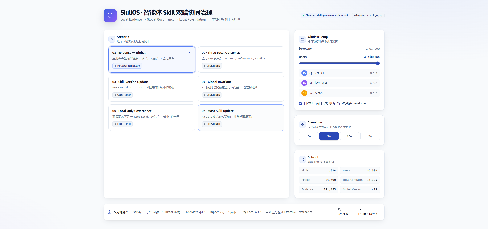
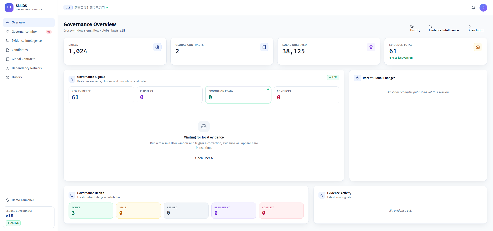
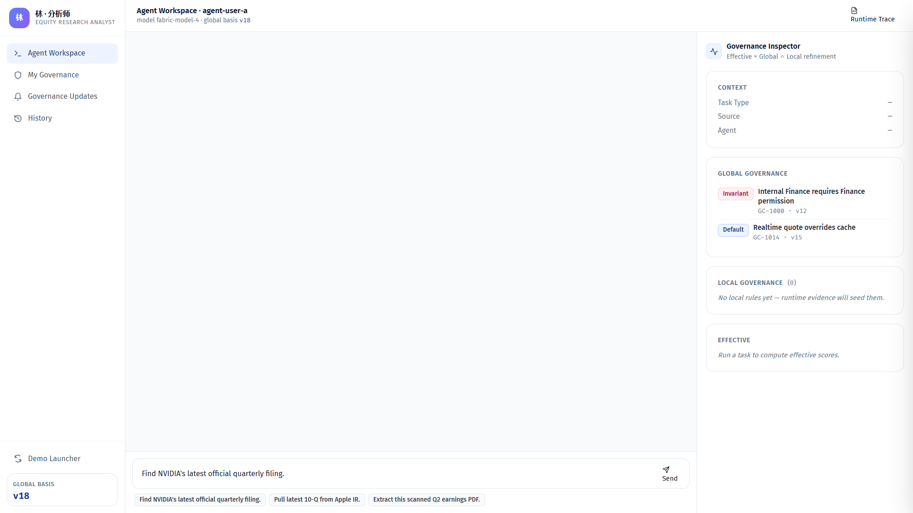
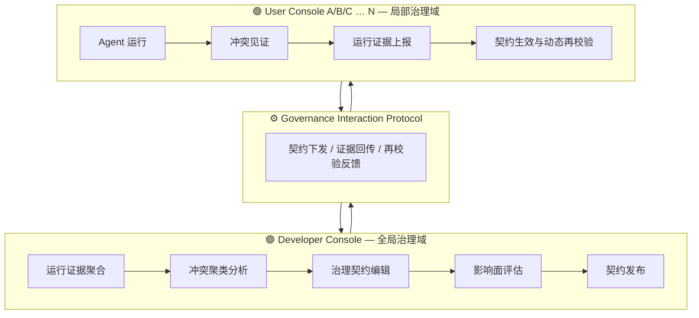

<div align="center">

# 🛡️ 智能体 Skill 双端协同治理系统

**Agent Skill Governance System**

基于 **运行证据反馈** 与 **治理契约依赖** 的智能体技能双端协同治理方案 —— 专利文档 + 完整前端演示系统


</div>

---

## 📸 界面预览

| 演示启动器 | 开发者治理控制台 | 用户工作台 |
| :-: | :-: | :-: |
|  |  |  |

> 完整 27 步交互演示截图见 [`web/screenshots/demo/`](web/screenshots/demo/)，演示脚本见 [`web/src/app/demoScript.ts`](web/src/app/demoScript.ts)。

---

## ✨ 核心特性

- **🔄 双端协同治理** — Developer Console（全局治理域）与 User Console（局部治理域）彼此独立，又通过治理协议持续互相感知
- **📡 运行证据驱动** — 治理规则不是凭空编写，而是从 User Runtime 的真实运行证据（冲突、纠正、反馈）中自然涌现
- **📜 治理契约依赖** — 规则以"治理契约"形态发布，自动做依赖分析、冲突检测与影响面评估
- **🧩 冲突见证与消解** — 跨用户证据聚合 → 冲突聚类 → 开发者评审 → 契约发布 → 全端传播的完整闭环
- **✅ 动态再校验** — 规则发布后持续跟踪各 Agent 运行结果，支持证据补强、降级与撤回
- **🎬 一键交互演示** — Demo Launcher 内置多用户（A/B/C）+ 开发者完整剧情，边看边学

---

## 🏗️ 系统架构



**治理闭环**：`User Runtime` → `运行证据` → `本地治理` → `跨用户证据聚合` → `冲突聚类` → `开发者评审` → `契约发布` → `全端传播` → `动态再校验` → 回到起点。

---

## 🧰 技术栈

| 层面 | 技术 |
| --- | --- |
| 框架 | React 18 + TypeScript 5.5 + Vite 5 |
| 样式 | Tailwind CSS 3 + 自定义动画 (framer-motion) |
| 状态 | Zustand（governance / presentation 双 store） |
| 路由 | React Router 6 |

核心治理引擎位于 [`web/src/engines/`](web/src/engines/)：`aggregation`（证据聚合）、`clusterSync`（冲突聚类）、`dependency`（契约依赖）、`evidence`（证据模型）、`governance`（治理规则）、`revalidation`（动态再校验）。

---

## 🚀 快速开始

```bash
cd web
npm install
npm run dev        # 开发模式，默认 http://localhost:5173
npm run build      # 生产构建
npm run preview    # 预览构建产物
```

打开页面后从 **Demo Launcher** 进入，可选择开发者端 / 用户端 / 全流程演示。

---

## 📁 项目结构

```
├── web/                        # 前端演示系统（React + Vite）
│   ├── src/
│   │   ├── engines/            # 六大治理引擎
│   │   ├── components/         # Developer / User 双端组件
│   │   ├── pages/              # 页面（dev 端 10 个 / user 端 9 个）
│   │   ├── store/              # Zustand 状态管理
│   │   ├── fixtures/           # 演示基础数据
│   │   └── app/                # App 入口 + 演示脚本
│   └── screenshots/            # 界面与全流程演示截图
├── 智能体 Skill 双端协同治理系统——总体架构、动态交互与完整前端设计说明书 V3.0.md
├── 智能体 Skill 双端协同治理系统——前端工程与交互实现规格说明书 V4.0.md
└── 一种基于运行证据反馈与治理契约依赖的智能体技能双端协同治理方法.md   # 专利文档
```

---

## 📚 文档

| 文档 | 说明 |
| --- | --- |
| [专利方法文档](一种基于运行证据反馈与治理契约依赖的智能体技能双端协同治理方法.md) | 一种基于运行证据反馈与治理契约依赖的智能体技能双端协同治理方法 |
| [总体设计说明书 V3.0](智能体%20Skill%20双端协同治理系统——总体架构、动态交互与完整前端设计说明书%20V3.0.md) | 总体架构、动态交互与完整前端设计 |
| [前端规格说明书 V4.0](智能体%20Skill%20双端协同治理系统——前端工程与交互实现规格说明书%20V4.0.md) | 前端工程与交互实现规格 |
| [相关方法研究](other/) | 基于冲突见证与治理契约的关系治理 / 双端协同治理方法 |

---

<div align="center">

**⭐ 如果这个项目对你有启发，欢迎 Star！**

</div>
