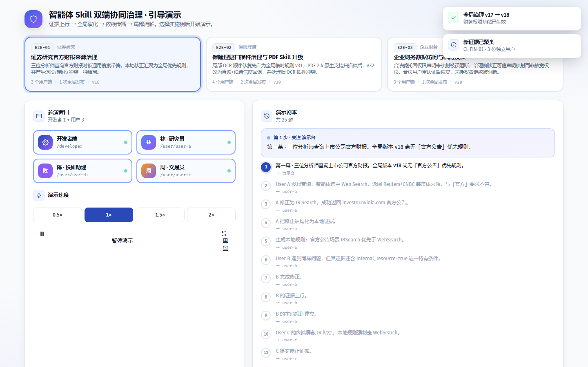
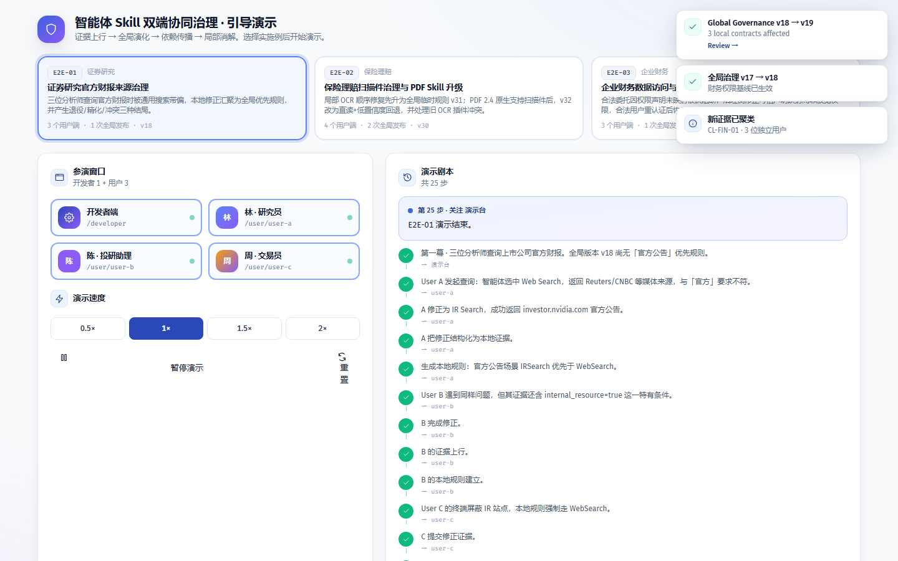

# 证券研究官方财报来源治理 — 演示文档（内部审查版）

> 生成时间：2026-08-20 08:44 ｜ 环境：Chromium 1440×900，播放速度 1× ｜ 剧本源：`src/app/demoScript.ts`（共 25 步）
> ⚠️ 本文件含编排控制台（Launcher），仅供内部 QA 与专利审查；对外演示请使用 `DEMO-Whitepaper-E2E-01.md`。

## 0. 参演窗口

| 窗口 | 路径 |
| --- | --- |
| 开发者端 | `/developer` |
| 林 · 研究员 | `/user/user-a` |
| 陈 · 投研助理 | `/user/user-b` |
| 周 · 交易员 | `/user/user-c` |

## 1. 分步演示记录

### 步骤 1 · `intro`（演示台）

- **具体操作**：——
- **旁白**：第一幕 · 三位分析师查询上市公司官方财报。全局版本 v18 尚无「官方公告」优先规则。

### 步骤 2 · `a-run`（林 · 研究员）

- **具体操作**：在「林 · 研究员」工作台输入任务「查一下英伟达最新的官方季度财报（10-Q）」并运行（命令 `run`）
- **旁白**：User A 发起查询：智能体选中 Web Search，返回 Reuters/CNBC 等媒体来源，与「官方」要求不符。

### 步骤 3 · `a-correct`（林 · 研究员）

- **具体操作**：点击「修正」，改用建议的替代技能（命令 `correct`）
- **旁白**：A 修正为 IR Search，成功返回 investor.nvidia.com 官方公告。

### 步骤 4 · `a-build`（林 · 研究员）

- **具体操作**：点击「结构化证据」，将本次运行记录结构化为证据（命令 `buildEvidence`）
- **旁白**：A 把修正结构化为本地证据。

### 步骤 5 · `a-rule`（林 · 研究员）

- **具体操作**：点击「同时创建本地规则」，把修正沉淀为本地治理规则（命令 `createLocalRule`）
- **旁白**：生成本地规则：官方公告场景 IRSearch 优先于 WebSearch。

### 步骤 6 · `b-run`（陈 · 投研助理）

- **具体操作**：在「陈 · 投研助理」工作台输入任务「查一下英伟达最新的官方季度财报（10-Q）」并运行（命令 `run`）
- **旁白**：User B 遇到同样问题，但其证据还含 internal_resource=true 这一特有条件。

### 步骤 7 · `b-correct`（陈 · 投研助理）

- **具体操作**：点击「修正」，改用建议的替代技能（命令 `correct`）
- **旁白**：B 完成修正。

### 步骤 8 · `b-build`（陈 · 投研助理）

- **具体操作**：点击「结构化证据」，将本次运行记录结构化为证据（命令 `buildEvidence`）
- **旁白**：B 的证据上行。

### 步骤 9 · `b-rule`（陈 · 投研助理）

- **具体操作**：点击「同时创建本地规则」，把修正沉淀为本地治理规则（命令 `createLocalRule`）
- **旁白**：B 的本地规则建立。

### 步骤 10 · `c-run`（周 · 交易员）

- **具体操作**：在「周 · 交易员」工作台输入任务「查一下英伟达最新的官方季度财报（10-Q）」并运行（命令 `run`）
- **旁白**：User C 的终端屏蔽 IR 站点，本地规则强制走 WebSearch。

### 步骤 11 · `c-correct`（周 · 交易员）

- **具体操作**：点击「修正」，改用建议的替代技能（命令 `correct`）
- **旁白**：C 提交修正证据。

### 步骤 12 · `c-build`（周 · 交易员）

- **具体操作**：点击「结构化证据」，将本次运行记录结构化为证据（命令 `buildEvidence`）
- **旁白**：第三份证据汇聚。

### 步骤 13 · `c-rule`（周 · 交易员）

- **具体操作**：点击「同时创建本地规则」，把修正沉淀为本地治理规则（命令 `createLocalRule`）
- **旁白**：C 的本地规则（强制 WebSearch）建立——它将与全局规则冲突。

### 步骤 14 · `dev-cluster`（开发者端）

- **具体操作**：打开「/developer/证据」页面（命令 `navigate`）
- **旁白**：第三幕 · 三份证据自动聚类，独立用户数=3、一致性=100%，升级评分越过阈值 → PROMOTION READY。

### 步骤 15 · `dev-candidate`（开发者端）

- **具体操作**：打开自动生成的全局候选规则进行审查（命令 `openCandidate`）
- **旁白**：生成全局候选：IRSearch 优先于 WebSearch。

### 步骤 16 · `dev-approve`（开发者端）

- **具体操作**：审批通过候选规则，进入全局契约编辑器（命令 `approveCandidate`）
- **旁白**：开发者审批通过，进入契约编辑器。

### 步骤 17 · `dev-impact`（开发者端）

- **具体操作**：运行影响分析，扫描依赖图（命令 `runImpact`）
- **旁白**：影响分析：扫描出受影响本地契约。

### 步骤 18 · `dev-publish`（开发者端）

- **具体操作**：发布全局治理版本（命令 `publish`）
- **旁白**：发布全局治理 v18 → v19。

### 步骤 19 · `dev-propagation`（开发者端）

- **具体操作**：打开「/developer/propagation/DELTA-19」页面（命令 `navigate`）
- **旁白**：传播监控：提交→依赖扫描→本地失效→重验证。

### 步骤 20 · `outcome-a`（林 · 研究员）

- **具体操作**：打开「/user/user-a/governance」页面（命令 `navigate`）
- **旁白**：A 的规则被全局完全覆盖 → RETIRED。

### 步骤 21 · `outcome-b`（陈 · 投研助理）

- **具体操作**：打开「/user/user-b/governance」页面（命令 `navigate`）
- **旁白**：B 保留 internal_resource 条件 → ACTIVE_REFINEMENT。

### 步骤 22 · `outcome-c`（周 · 交易员）

- **具体操作**：打开「/user/user-c/conflicts/LC-C-01」页面（命令 `navigate`）
- **旁白**：C 与全局方向相反 → CONFLICT，进入冲突解决器。

### 步骤 23 · `closure`（林 · 研究员）

- **具体操作**：打开「/user/user-a」页面（命令 `navigate`）
- **旁白**：第五幕 · 闭环验证。

### 步骤 24 · `closure-run`（林 · 研究员）

- **具体操作**：在「林 · 研究员」工作台输入任务「查一下英伟达最新的官方季度财报（10-Q）」并运行（命令 `run`）
- **旁白**：A 重跑同一任务，全局规则生效，直接返回官方来源。

### 步骤 25 · `end`（演示台）

- **具体操作**：——
- **旁白**：E2E-01 演示结束。

---

## 附注

- 重跑：`python scripts/capture_demo.py`（`DEMO_SCENARIO=e2e-01` 单跑本场景）。
