# 保险理赔扫描件治理与 PDF Skill 升级 — 演示文档（内部审查版）

> 生成时间：2026-08-20 08:45 ｜ 环境：Chromium 1440×900，播放速度 1× ｜ 剧本源：`src/app/demoScript.ts`（共 24 步）
> ⚠️ 本文件含编排控制台（Launcher），仅供内部 QA 与专利审查；对外演示请使用 `DEMO-Whitepaper-E2E-02.md`。

## 0. 参演窗口

| 窗口 | 路径 |
| --- | --- |
| 开发者端 | `/developer` |
| 王 · 华东理赔 | `/user/user-east` |
| 李 · 华南理赔 | `/user/user-south` |
| 赵 · 车险传真 | `/user/user-fax` |
| 孙 · 旧插件 | `/user/user-legacy` |

## 1. 分步演示记录

### 步骤 1 · `intro`（演示台）

- **具体操作**：——
- **旁白**：E2E-02 · 三个理赔团队处理扫描件。PDF Extraction 2.3 不原生支持扫描件，字段召回率仅 41%。

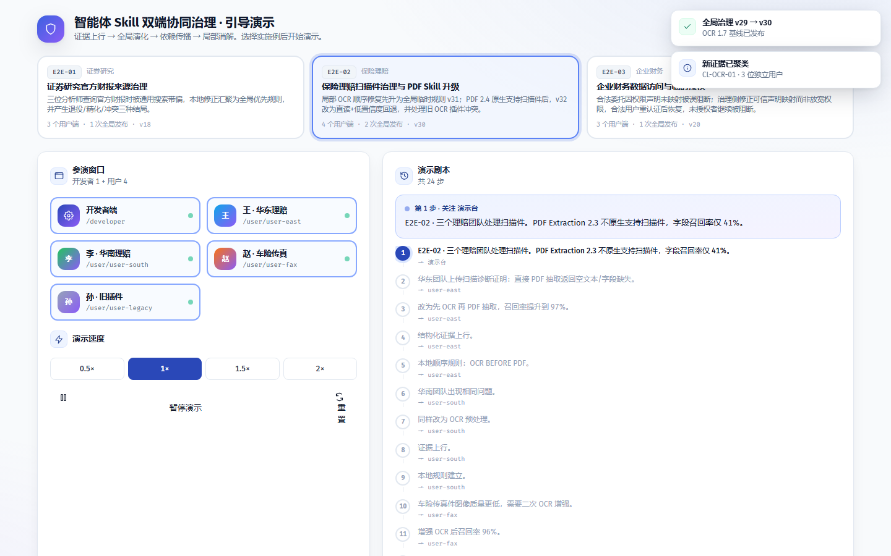

### 步骤 2 · `east-run`（王 · 华东理赔）

- **具体操作**：在「王 · 华东理赔」工作台输入任务「scanned-pdf」并运行（命令 `run`）
- **旁白**：华东团队上传扫描诊断证明：直接 PDF 抽取返回空文本/字段缺失。

### 步骤 3 · `east-correct`（王 · 华东理赔）

- **具体操作**：点击「修正」，改用建议的替代技能（命令 `correct`）
- **旁白**：改为先 OCR 再 PDF 抽取，召回率提升到 97%。

### 步骤 4 · `east-build`（王 · 华东理赔）

- **具体操作**：点击「结构化证据」，将本次运行记录结构化为证据（命令 `buildEvidence`）
- **旁白**：结构化证据上行。

### 步骤 5 · `east-rule`（王 · 华东理赔）

- **具体操作**：点击「同时创建本地规则」，把修正沉淀为本地治理规则（命令 `createLocalRule`）
- **旁白**：本地顺序规则：OCR BEFORE PDF。

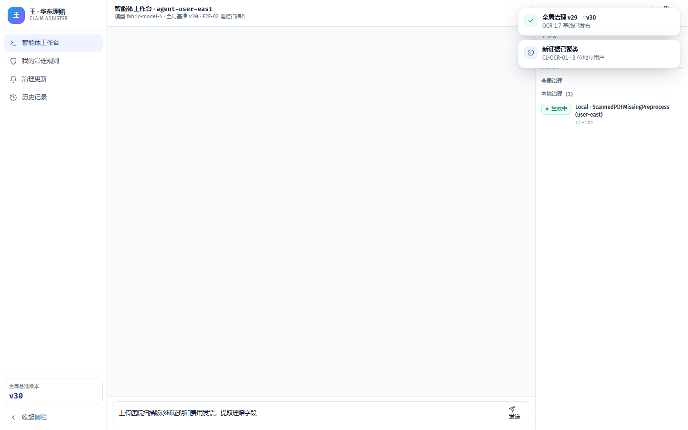

### 步骤 6 · `south-run`（李 · 华南理赔）

- **具体操作**：在「李 · 华南理赔」工作台输入任务「scanned-pdf」并运行（命令 `run`）
- **旁白**：华南团队出现相同问题。

### 步骤 7 · `south-correct`（李 · 华南理赔）

- **具体操作**：点击「修正」，改用建议的替代技能（命令 `correct`）
- **旁白**：同样改为 OCR 预处理。

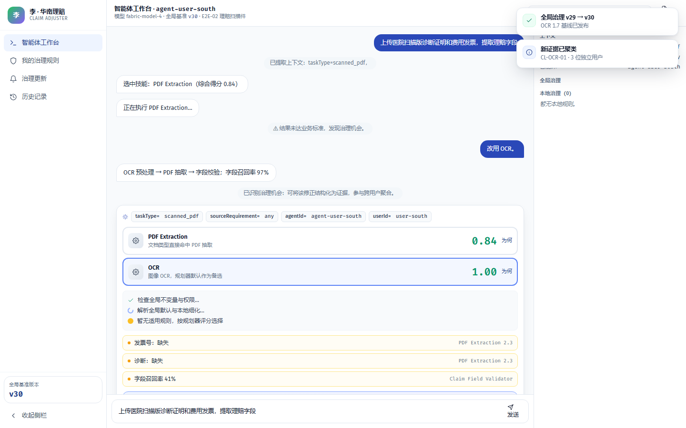

### 步骤 8 · `south-build`（李 · 华南理赔）

- **具体操作**：点击「结构化证据」，将本次运行记录结构化为证据（命令 `buildEvidence`）
- **旁白**：证据上行。

### 步骤 9 · `south-rule`（李 · 华南理赔）

- **具体操作**：点击「同时创建本地规则」，把修正沉淀为本地治理规则（命令 `createLocalRule`）
- **旁白**：本地规则建立。

### 步骤 10 · `fax-run`（赵 · 车险传真）

- **具体操作**：在「赵 · 车险传真」工作台输入任务「fax-pdf」并运行（命令 `run`）
- **旁白**：车险传真件图像质量更低，需要二次 OCR 增强。

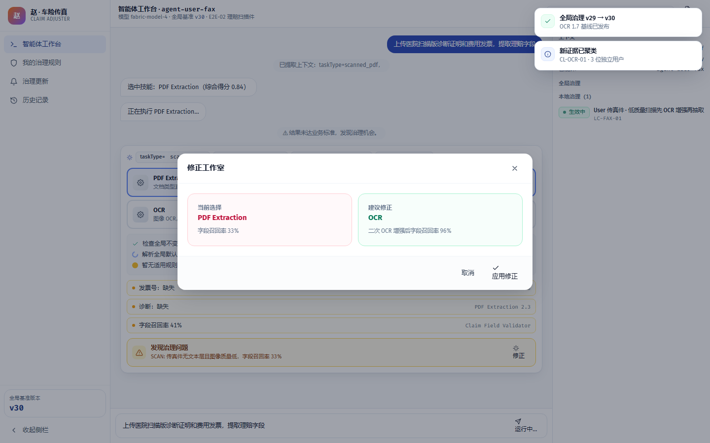

### 步骤 11 · `fax-correct`（赵 · 车险传真）

- **具体操作**：点击「修正」，改用建议的替代技能（命令 `correct`）
- **旁白**：增强 OCR 后召回率 96%。

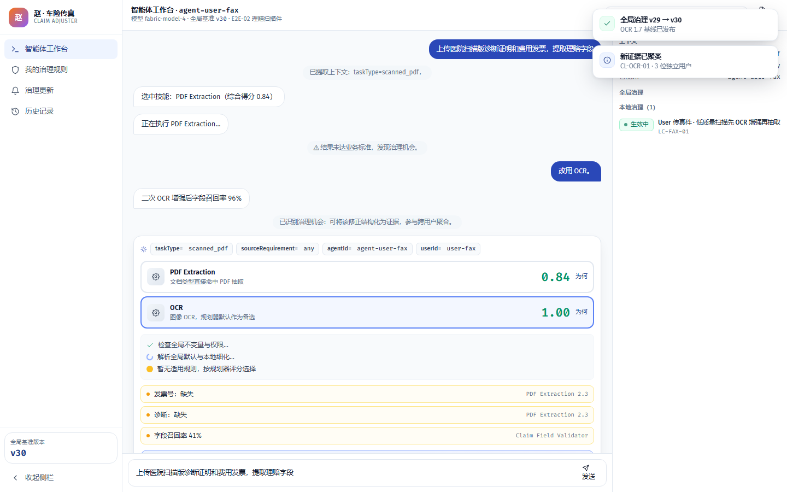

### 步骤 12 · `fax-build`（赵 · 车险传真）

- **具体操作**：点击「结构化证据」，将本次运行记录结构化为证据（命令 `buildEvidence`）
- **旁白**：证据携带 image_quality=low 特有条件。

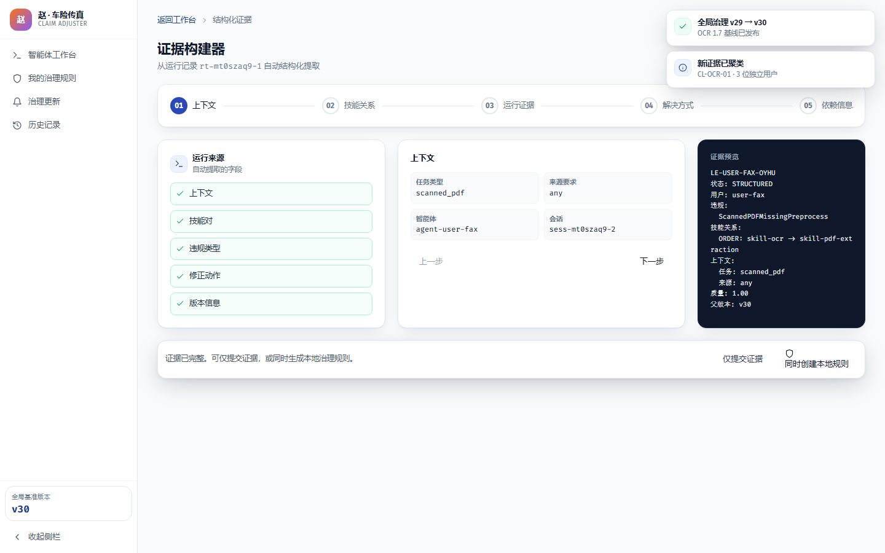

### 步骤 13 · `dev-cluster`（开发者端）

- **具体操作**：打开「/developer/证据」页面（命令 `navigate`）
- **旁白**：治理侧按 PDF 2.3 / OCR 1.7 版本聚类，确认跨团队共性。

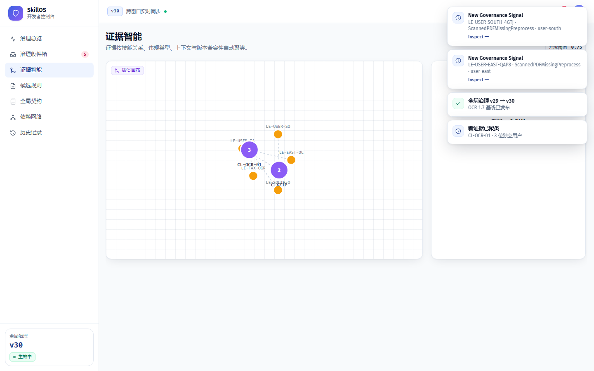

### 步骤 14 · `dev-candidate`（开发者端）

- **具体操作**：打开自动生成的全局候选规则进行审查（命令 `openCandidate`）
- **旁白**：生成全局候选：scanned_pdf 先 OCR 再抽取。

### 步骤 15 · `dev-approve`（开发者端）

- **具体操作**：审批通过候选规则，进入全局契约编辑器（命令 `approveCandidate`）
- **旁白**：审批通过。

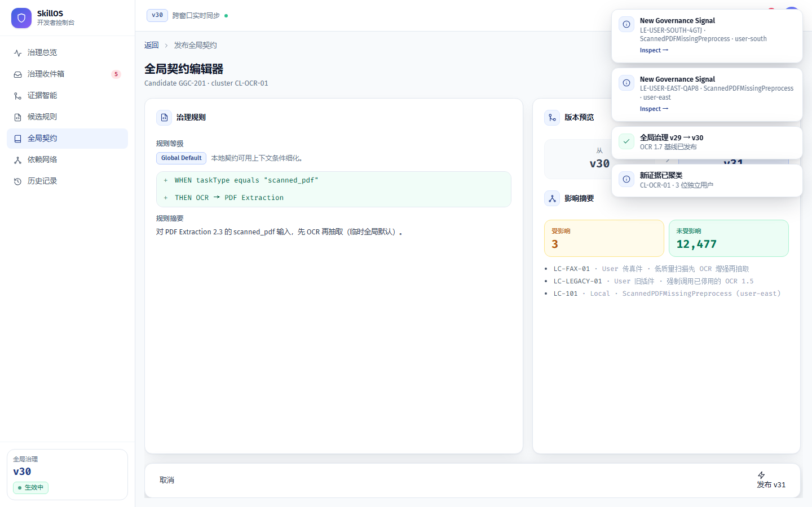

### 步骤 16 · `dev-impact`（开发者端）

- **具体操作**：运行影响分析，扫描依赖图（命令 `runImpact`）
- **旁白**：影响分析：标准团队规则将被覆盖，传真件规则保留细化。

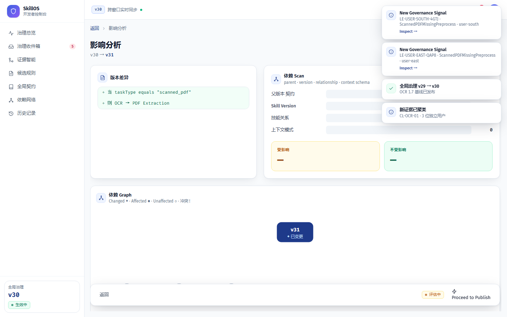

### 步骤 17 · `publish-v31`（开发者端）

- **具体操作**：发布全局治理版本（命令 `publish`）
- **旁白**：发布临时全局规则 v31：scanned_pdf → OCR → PDF 2.3。

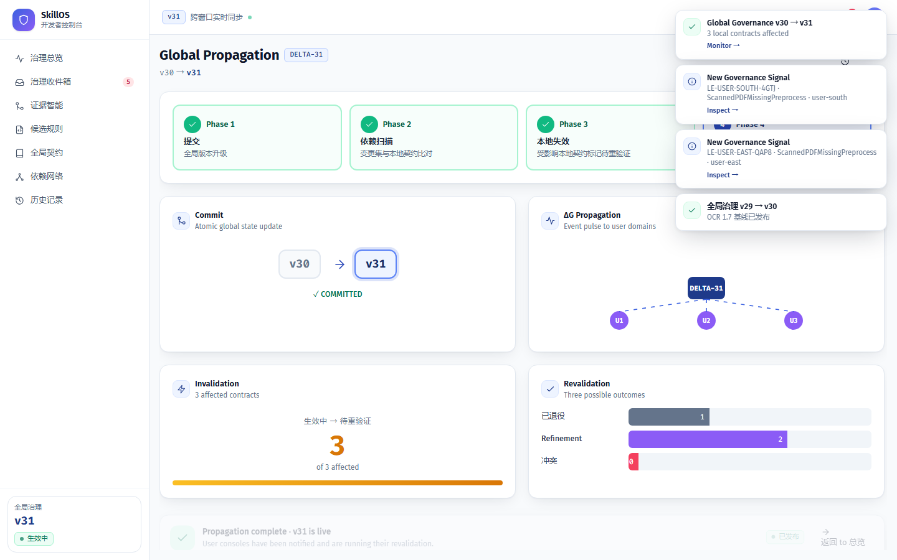

### 步骤 18 · `propagation-v31`（开发者端）

- **具体操作**：打开「/developer/propagation/DELTA-31」页面（命令 `navigate`）
- **旁白**：传播：华东/华南规则退役，传真件保持 ACTIVE_REFINEMENT。

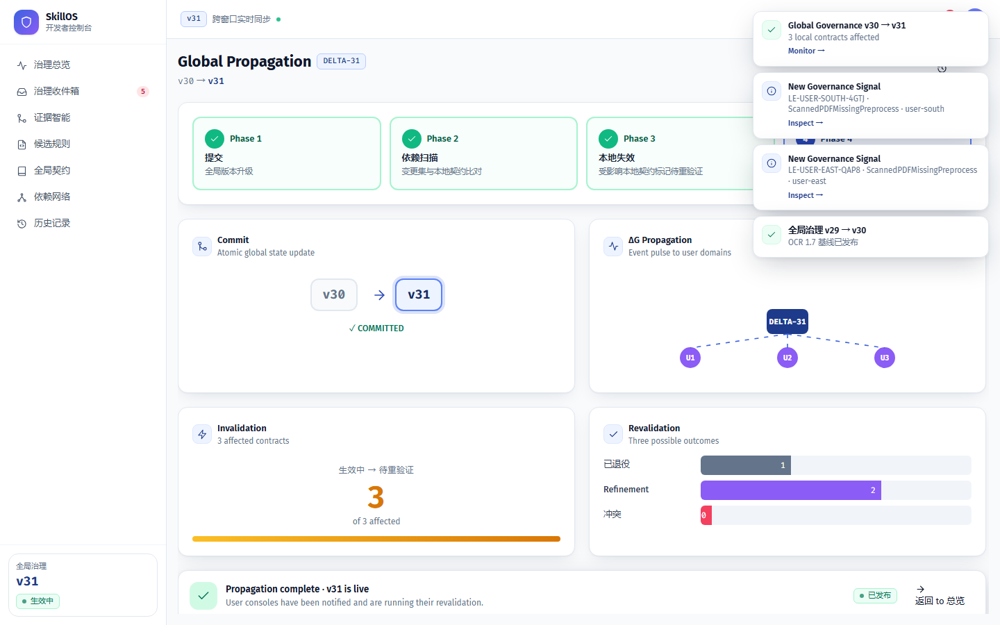

### 步骤 19 · `upgrade`（开发者端）

- **具体操作**：升级技能 skill-pdf-extraction → 2.4（命令 `applyUpgrade`）
- **旁白**：Skill 团队发布 PDF Extraction 2.4，原生支持扫描件。

### 步骤 20 · `publish-v32`（开发者端）

- **具体操作**：发布全局治理版本（命令 `publish`）
- **旁白**：影子回放后发布 v32：标准扫描件直读 2.4，native_confidence<0.92 才回退 OCR。

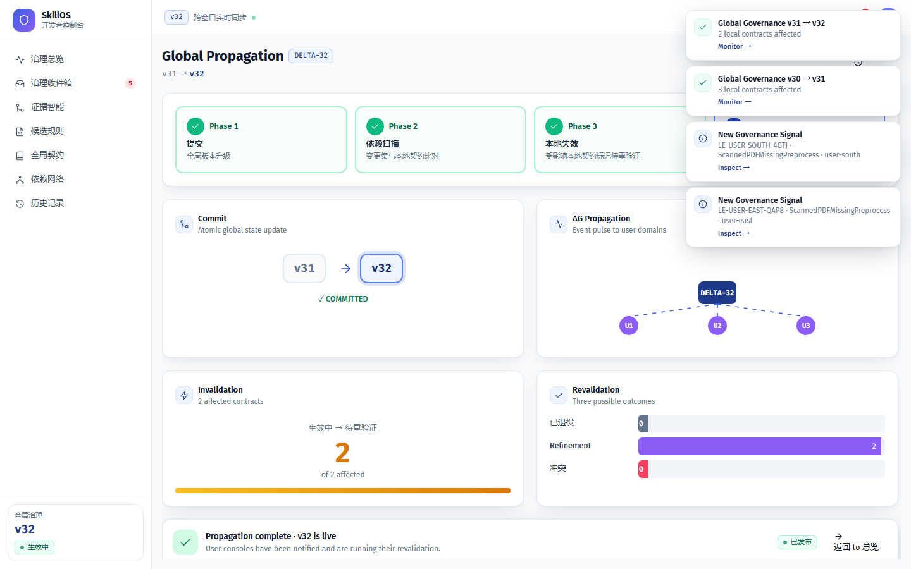

### 步骤 21 · `propagation-v32`（开发者端）

- **具体操作**：打开「/developer/propagation/DELTA-32」页面（命令 `navigate`）
- **旁白**：第二轮重验证：旧 OCR 1.5 插件用户因版本范围不兼容进入 CONFLICT。

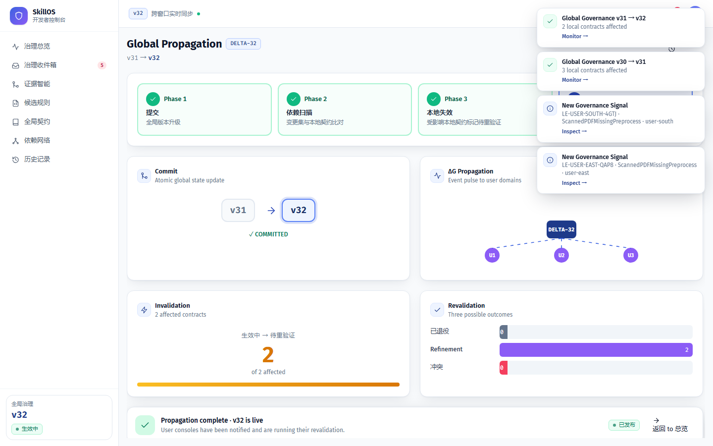

### 步骤 22 · `legacy-conflict`（孙 · 旧插件）

- **具体操作**：打开「/user/user-legacy/governance」页面（命令 `navigate`）
- **旁白**：旧插件用户需升级插件或转人工，不能继续绑定已停用版本。

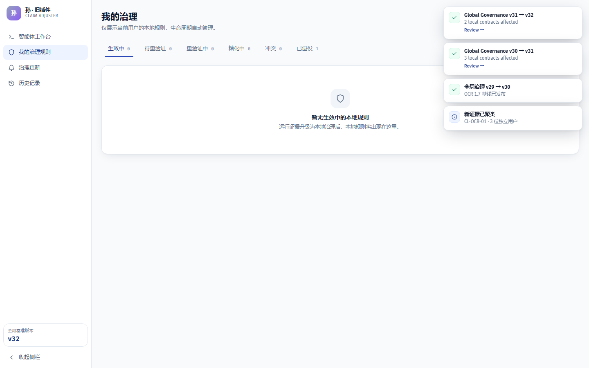

### 步骤 23 · `closure`（王 · 华东理赔）

- **具体操作**：在「王 · 华东理赔」工作台输入任务「scanned-pdf」并运行（命令 `run`）
- **旁白**：闭环：华东重跑样本，标准扫描件从三步缩短为两步，字段准确率保持。

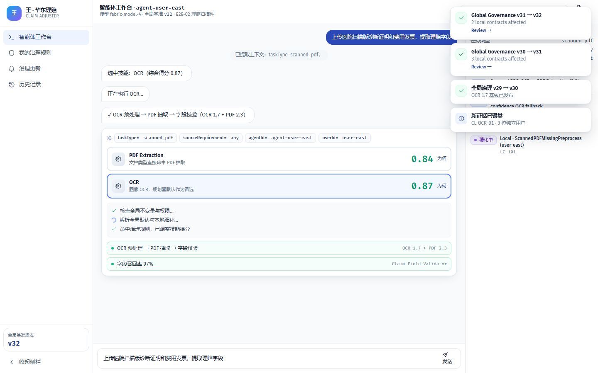

### 步骤 24 · `end`（演示台）

- **具体操作**：——
- **旁白**：E2E-02 演示结束。

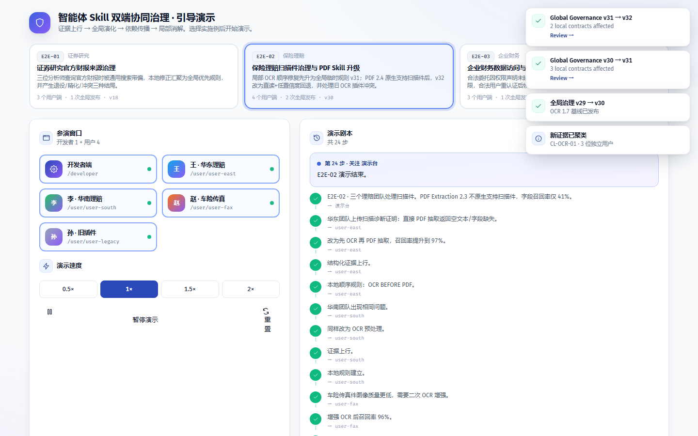

---

## 附注

- 重跑：`python scripts/capture_demo.py`（`DEMO_SCENARIO=e2e-02` 单跑本场景）。
