# 企业财务数据访问与临时授权 — 演示文档（内部审查版）

> 生成时间：2026-08-20 08:47 ｜ 环境：Chromium 1440×900，播放速度 1× ｜ 剧本源：`src/app/demoScript.ts`（共 17 步）
> ⚠️ 本文件含编排控制台（Launcher），仅供内部 QA 与专利审查；对外演示请使用 `DEMO-Whitepaper-E2E-03.md`。

## 0. 参演窗口

| 窗口 | 路径 |
| --- | --- |
| 开发者端 | `/developer` |
| 吴 · 财务经理 | `/user/user-fin-mgr` |
| 郑 · 财务经理 | `/user/user-fin-west` |
| 钱 · 分析师 | `/user/user-analyst` |

## 1. 分步演示记录

### 步骤 1 · `intro`（演示台）

- **具体操作**：——
- **旁白**：E2E-03 · 区域财务经理想读取内部费用数据。全局不变量要求 finance:read，当前会话无权限。

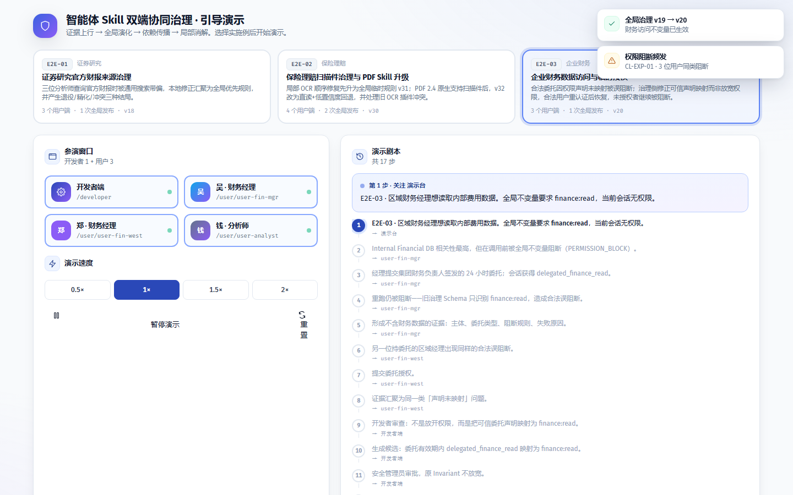

### 步骤 2 · `mgr-run`（吴 · 财务经理）

- **具体操作**：在「吴 · 财务经理」工作台输入任务「finance-analysis」并运行（命令 `run`）
- **旁白**：Internal Financial DB 相关性最高，但在调用前被全局不变量阻断（PERMISSION_BLOCK）。

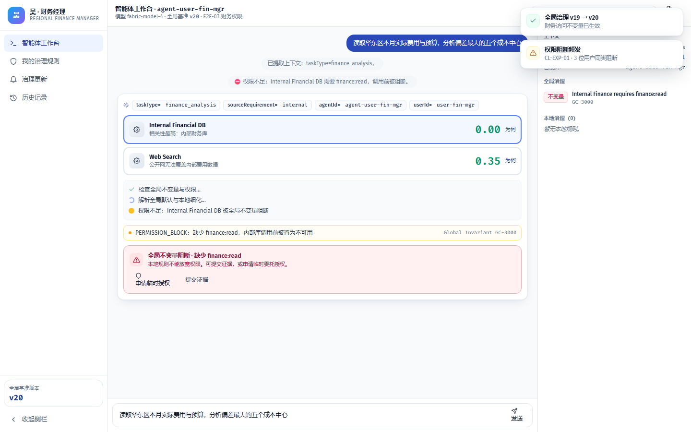

### 步骤 3 · `mgr-request`（吴 · 财务经理）

- **具体操作**：提交委托授权，为会话申请临时权限（命令 `requestGrant`）
- **旁白**：经理提交集团财务负责人签发的 24 小时委托；会话获得 delegated_finance_read。

### 步骤 4 · `mgr-rerun-blocked`（吴 · 财务经理）

- **具体操作**：在「吴 · 财务经理」工作台输入任务「finance-analysis」并运行（命令 `run`）
- **旁白**：重跑仍被阻断——旧治理 Schema 只识别 finance:read，造成合法误阻断。

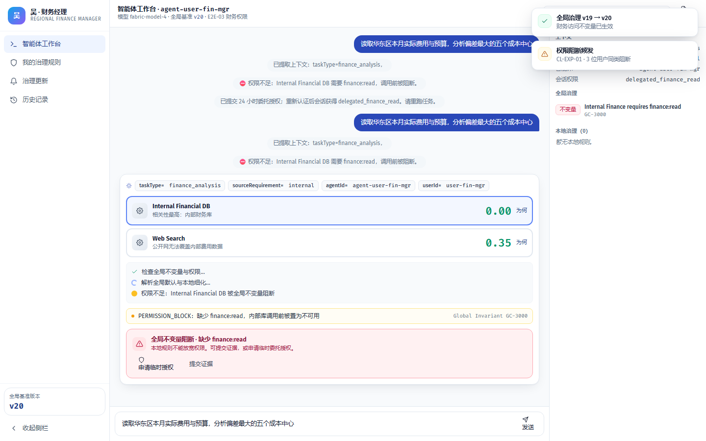

### 步骤 5 · `mgr-evidence`（吴 · 财务经理）

- **具体操作**：点击「结构化证据」，将本次运行记录结构化为证据（命令 `buildEvidence`）
- **旁白**：形成不含财务数据的证据：主体、委托类型、阻断规则、失败原因。

### 步骤 6 · `west-run`（郑 · 财务经理）

- **具体操作**：在「郑 · 财务经理」工作台输入任务「finance-analysis」并运行（命令 `run`）
- **旁白**：另一位持委托的区域经理出现同样的合法误阻断。

### 步骤 7 · `west-request`（郑 · 财务经理）

- **具体操作**：提交委托授权，为会话申请临时权限（命令 `requestGrant`）
- **旁白**：提交委托授权。

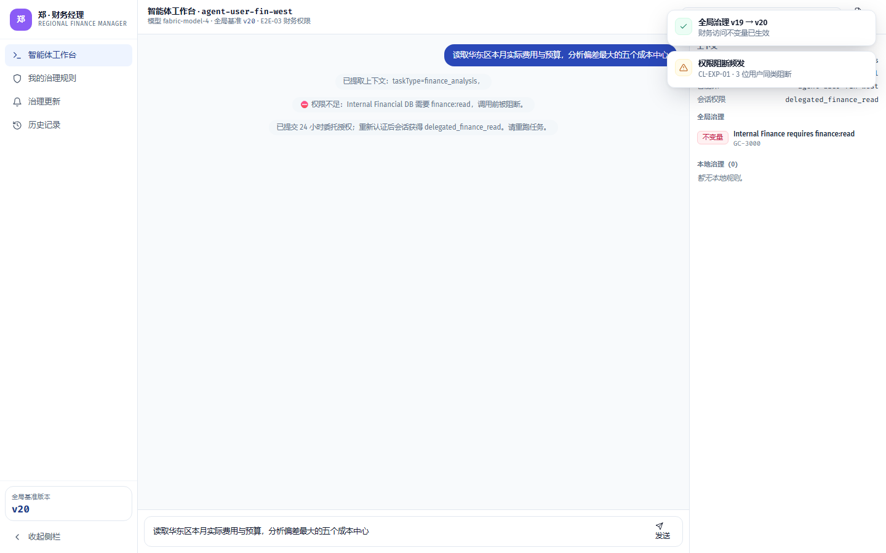

### 步骤 8 · `west-evidence`（郑 · 财务经理）

- **具体操作**：点击「结构化证据」，将本次运行记录结构化为证据（命令 `buildEvidence`）
- **旁白**：证据汇聚为同一类「声明未映射」问题。

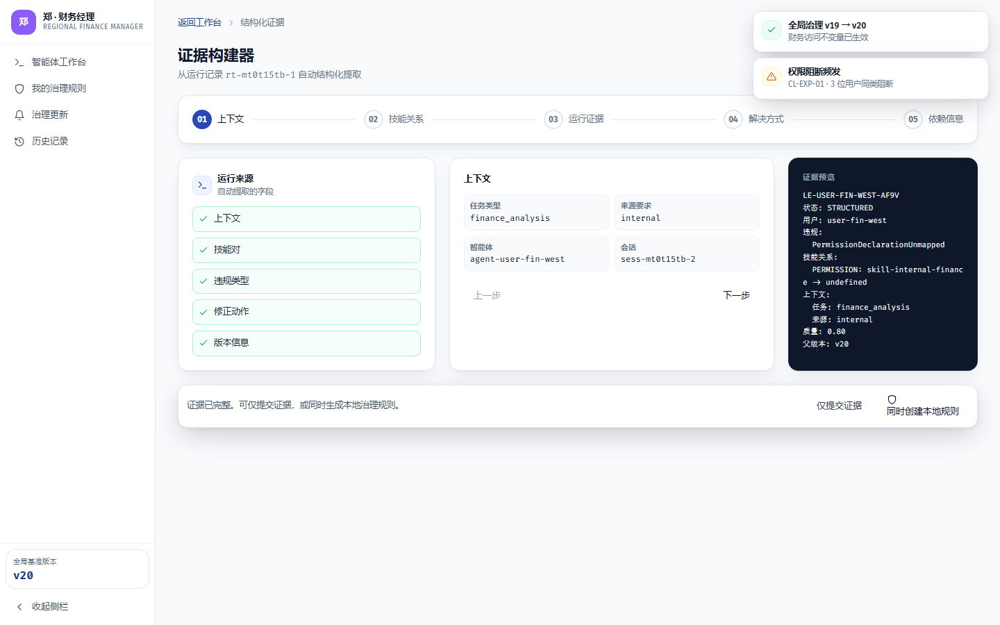

### 步骤 9 · `dev-cluster`（开发者端）

- **具体操作**：打开「/developer/证据」页面（命令 `navigate`）
- **旁白**：开发者审查：不是放开权限，而是把可信委托声明映射为 finance:read。

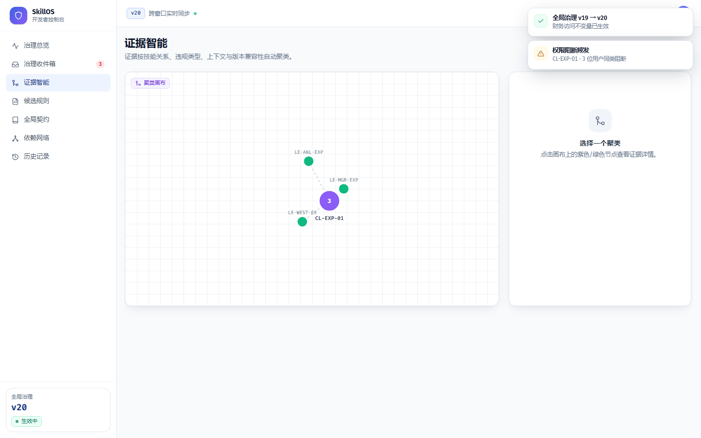

### 步骤 10 · `dev-candidate`（开发者端）

- **具体操作**：打开自动生成的全局候选规则进行审查（命令 `openCandidate`）
- **旁白**：生成候选：委托有效期内 delegated_finance_read 映射为 finance:read。

### 步骤 11 · `dev-approve`（开发者端）

- **具体操作**：审批通过候选规则，进入全局契约编辑器（命令 `approveCandidate`）
- **旁白**：安全管理员审批，原 Invariant 不放宽。

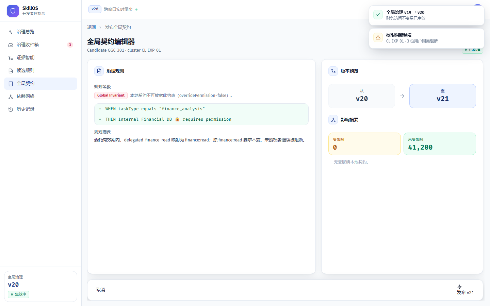

### 步骤 12 · `dev-impact`（开发者端）

- **具体操作**：运行影响分析，扫描依赖图（命令 `runImpact`）
- **旁白**：影响分析：权限 Schema 变更灰度到财务沙箱后发布。

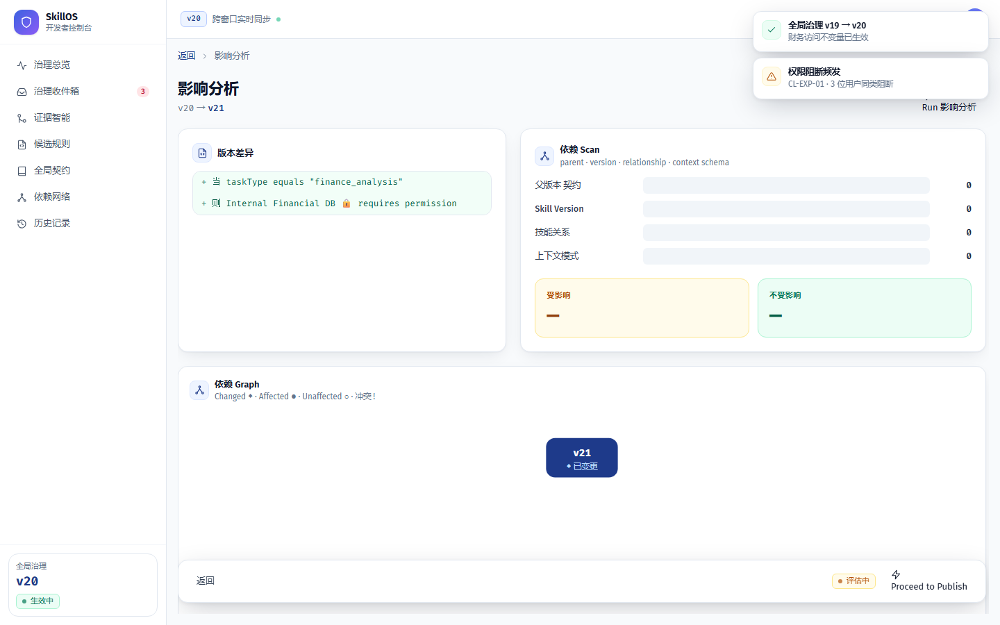

### 步骤 13 · `publish-v21`（开发者端）

- **具体操作**：发布全局治理版本（命令 `publish`）
- **旁白**：发布 v21：权限模型新增 delegated_finance_read 映射。

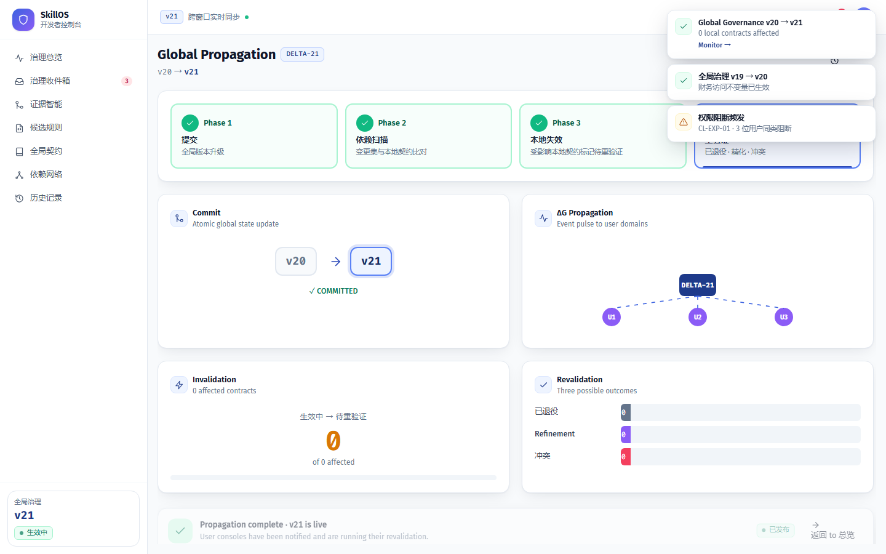

### 步骤 14 · `propagation`（开发者端）

- **具体操作**：打开「/developer/propagation/DELTA-21」页面（命令 `navigate`）
- **旁白**：权限 Schema 变更下行，相关规则重验证。

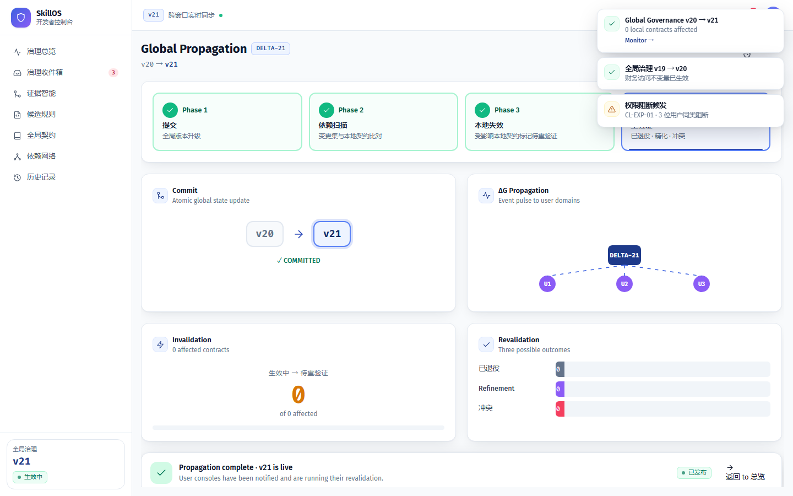

### 步骤 15 · `mgr-success`（吴 · 财务经理）

- **具体操作**：在「吴 · 财务经理」工作台输入任务「finance-analysis」并运行（命令 `run`）
- **旁白**：财务经理重跑：委托被映射为 finance:read，内部库调用放行，输出脱敏偏差报告。

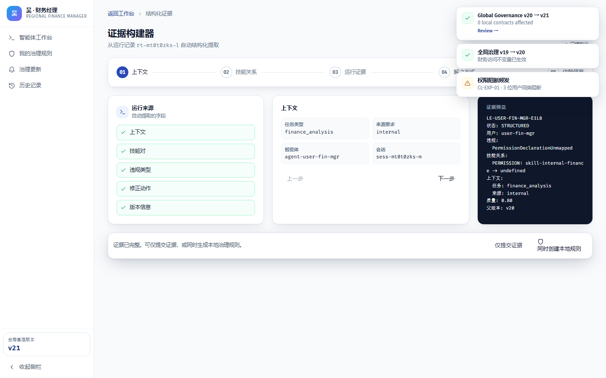

### 步骤 16 · `analyst-blocked`（钱 · 分析师）

- **具体操作**：在「钱 · 分析师」工作台输入任务「finance-analysis」并运行（命令 `run`）
- **旁白**：对照：无任何委托的分析师仍被阻断——安全边界未被降低。

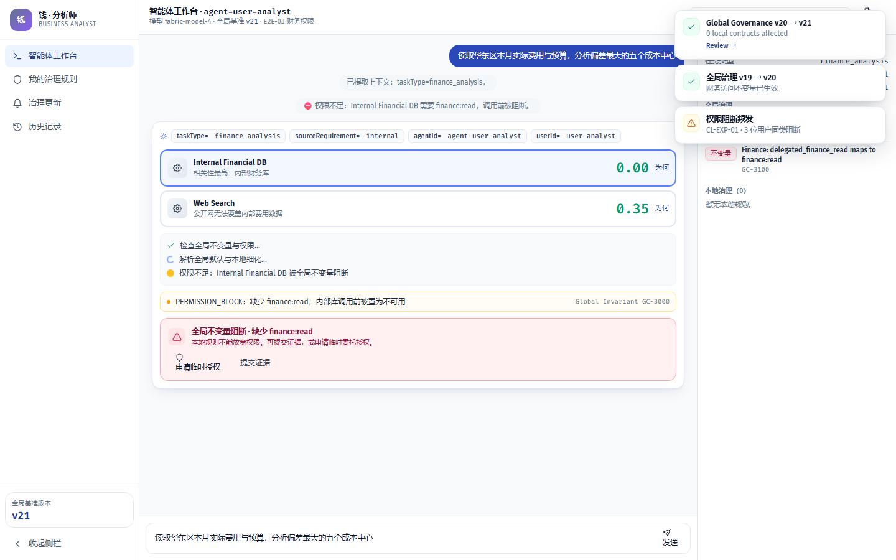

### 步骤 17 · `end`（演示台）

- **具体操作**：——
- **旁白**：E2E-03 演示结束。

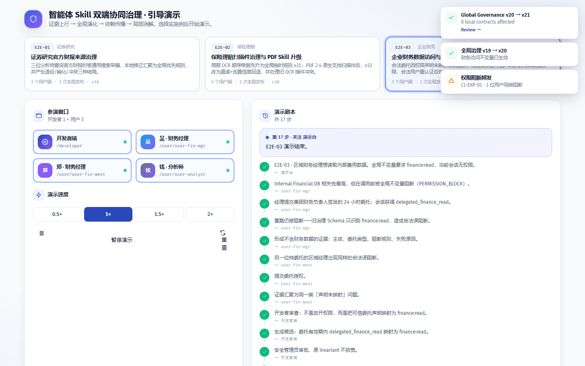

---

## 附注

- 重跑：`python scripts/capture_demo.py`（`DEMO_SCENARIO=e2e-03` 单跑本场景）。
