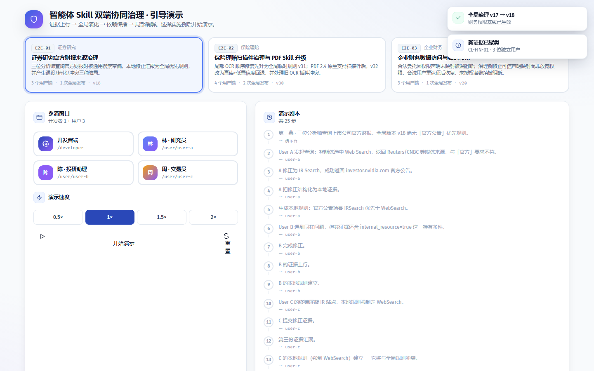
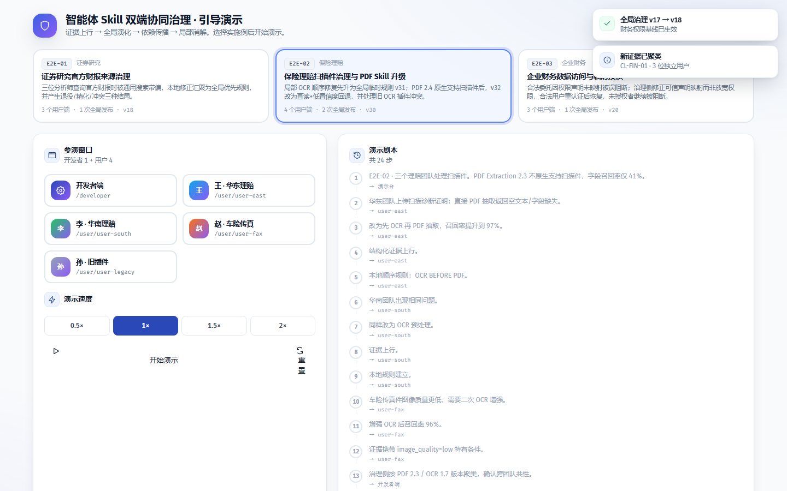
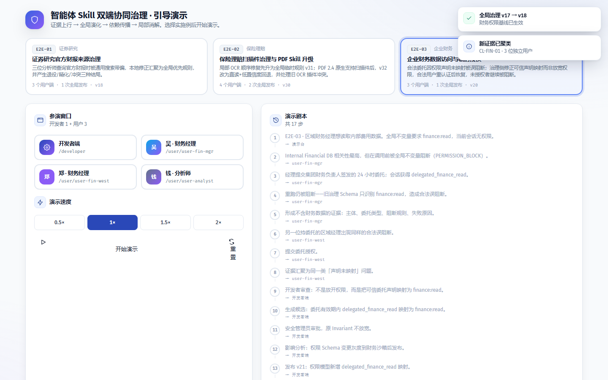

# 智能体 Skill 双端协同治理系统 — 完整演示文档（内部审查版）

> 生成时间：2026-08-20 07:51 ｜ Chromium 1440×900 ｜ 播放速度 1× ｜ 剧本源：`web/src/app/demoScript.ts`
> ⚠️ 含 Launcher 控制台与剧本旁白，仅供内部 QA 与专利审查；对外请用 `DEMO-Whitepaper.md`。

## 场景索引

| 编号 | 实施例 | 行业 | 核心治理机制 |
| --- | --- | --- | --- |
| E2E-01 | [证券研究官方财报来源治理](#e2e-01) | 证券研究 | PRIORITY / EXCLUSION / FALLBACK · 退役 · 精化 · 冲突 |
| E2E-02 | [保险理赔扫描件治理与 PDF Skill 升级](#e2e-02) | 保险理赔 | ORDER / FALLBACK · 两次全局发布 · 版本兼容 |
| E2E-03 | [企业财务数据访问与临时授权](#e2e-03) | 企业财务 | Global Invariant / PERMISSION · 权限映射 · 重认证 |

---

## E2E-01 · 证券研究官方财报来源治理

**行业**：证券研究 ｜ **机制**：PRIORITY / EXCLUSION / FALLBACK · 退役 · 精化 · 冲突 ｜ **截图数**：0

### 初始状态

| 窗口 | 截图 |
| --- | --- |
| 开发者端 |  |

### 分步骤记录

---

## E2E-02 · 保险理赔扫描件治理与 PDF Skill 升级

**行业**：保险理赔 ｜ **机制**：ORDER / FALLBACK · 两次全局发布 · 版本兼容 ｜ **截图数**：0

### 初始状态

| 窗口 | 截图 |
| --- | --- |
| 开发者端 |  |

### 分步骤记录

---

## E2E-03 · 企业财务数据访问与临时授权

**行业**：企业财务 ｜ **机制**：Global Invariant / PERMISSION · 权限映射 · 重认证 ｜ **截图数**：0

### 初始状态

| 窗口 | 截图 |
| --- | --- |
| 开发者端 |  |

### 分步骤记录

---

## 附注

- 截图脚本：`web/scripts/capture_demo.py`（Playwright，可重复执行）。
- 对外白皮书：`DEMO_MODE=presentation python scripts/capture_demo.py`。
- 剧本或场景调整后重新运行脚本即可刷新文档。
