# 智能体 Skill 双端协同治理系统 — 完整演示文档（自动截图）

> 生成时间：2026-08-19 10:01 ｜ 环境：Chromium 1440×900，播放速度 1× ｜ 剧本源：`src/app/demoScript.ts`（共 25 步）
> 截图为演示自动运行过程中各窗口的真实状态，按剧本顺序排列，可直接用于审阅。

## 0. 演示启动

### 0.1 演示台（Demo Launcher）

点击「开始演示」后，系统在同一浏览器内打开 4 个窗口（开发者端 + 用户 A/B/C），并通过 BroadcastChannel 事件总线按剧本下发命令。

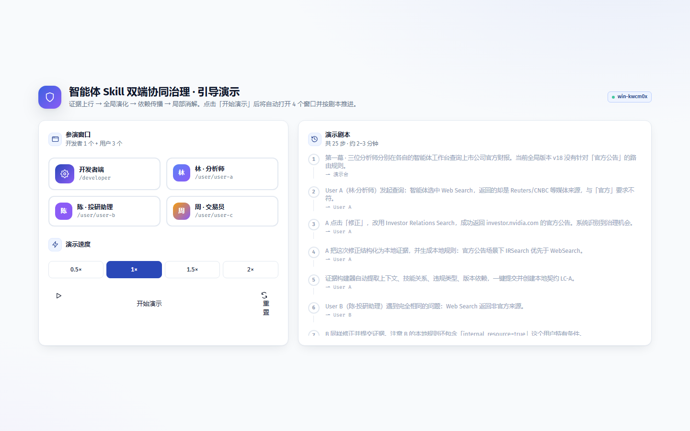

### 0.2 四个窗口初始状态

| 窗口 | 截图 |
| --- | --- |
| 开发者端（/developer） | 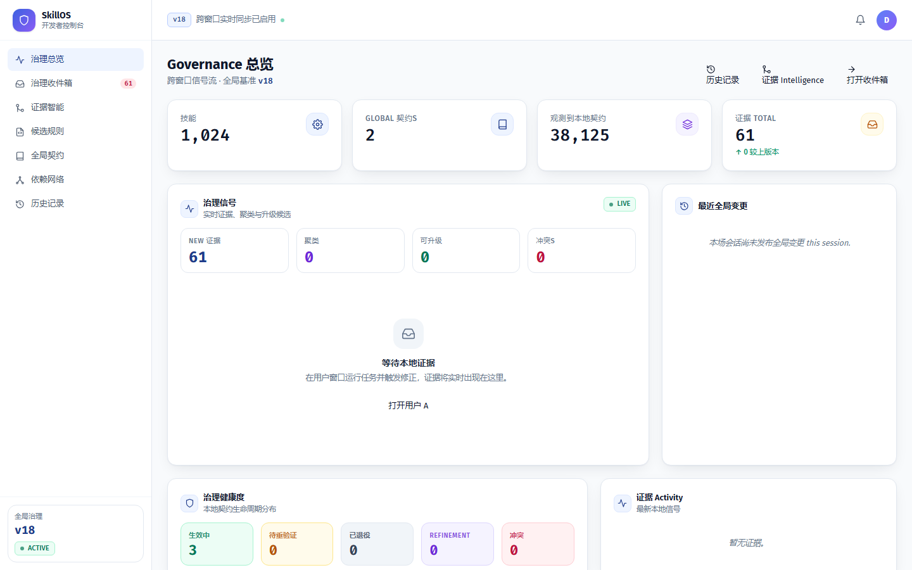 |
| User A · 林·分析师 | 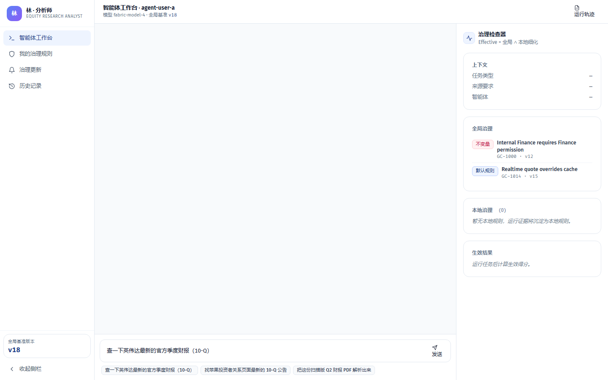 |
| User B · 陈·投研助理 | 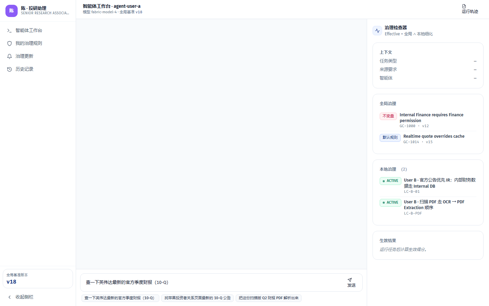 |
| User C · 周·交易员 | 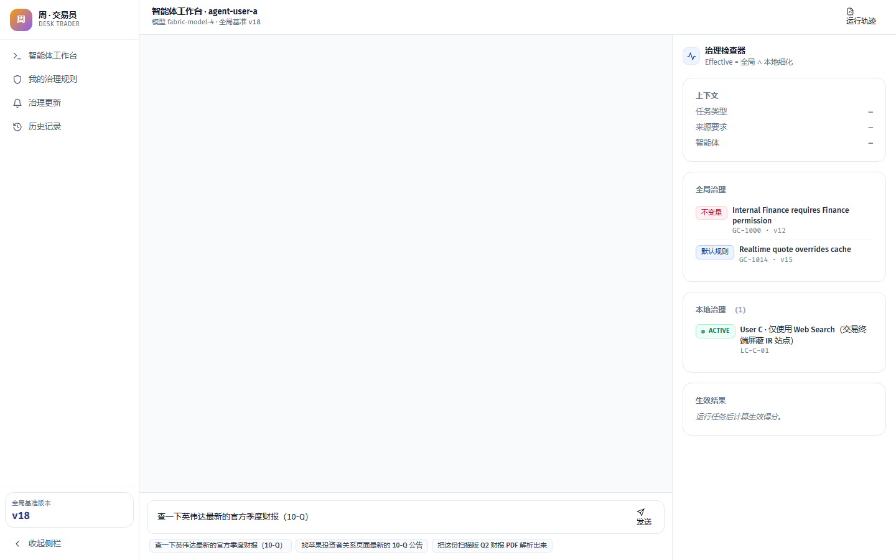 |

## 1. 分幕演示记录

### 第一幕 · User A 遭遇问题并沉淀本地规则（步骤 1–5）

#### 步骤 1 · `intro`（关注窗口：launcher）

> **旁白**：第一幕 · 三位分析师分别在各自的智能体工作台查询上市公司官方财报。当前全局版本 v18 没有针对「官方公告」的路由规则。

**看点**：演示台展示剧本时间线与事件日志

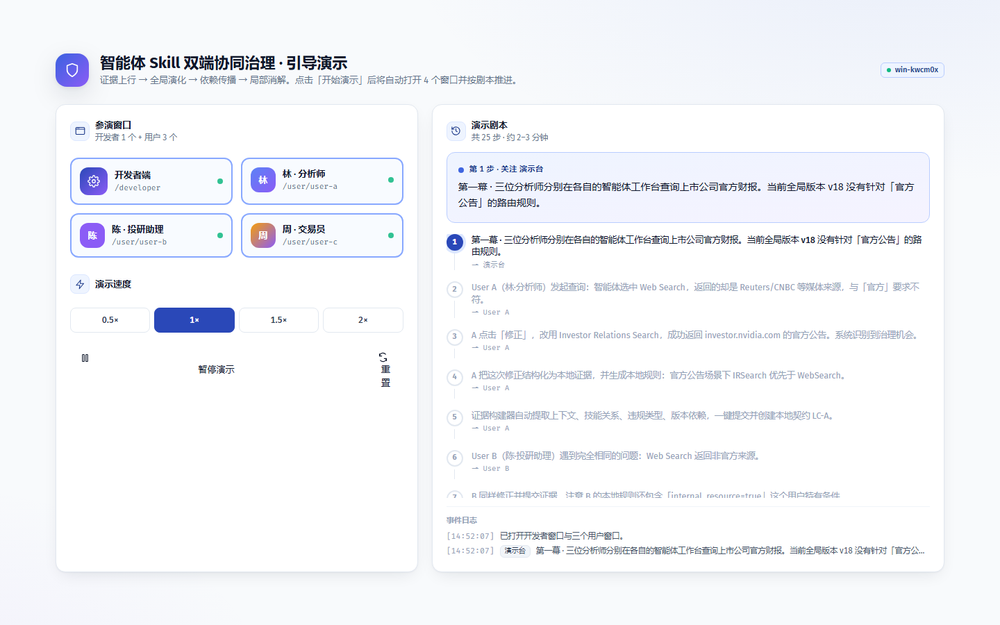

#### 步骤 2 · `a-run`（关注窗口：user-a）

> **旁白**：User A（林·分析师）发起查询：智能体选中 Web Search，返回的却是 Reuters/CNBC 等媒体来源，与「官方」要求不符。

**看点**：运行结果出现非官方来源告警，提示治理机会

#### 步骤 3 · `a-correct`（关注窗口：user-a）

> **旁白**：A 点击「修正」，改用 Investor Relations Search，成功返回 investor.nvidia.com 的官方公告。系统识别到治理机会。

**看点**：技能切换成功，出现「识别到治理机会」横幅

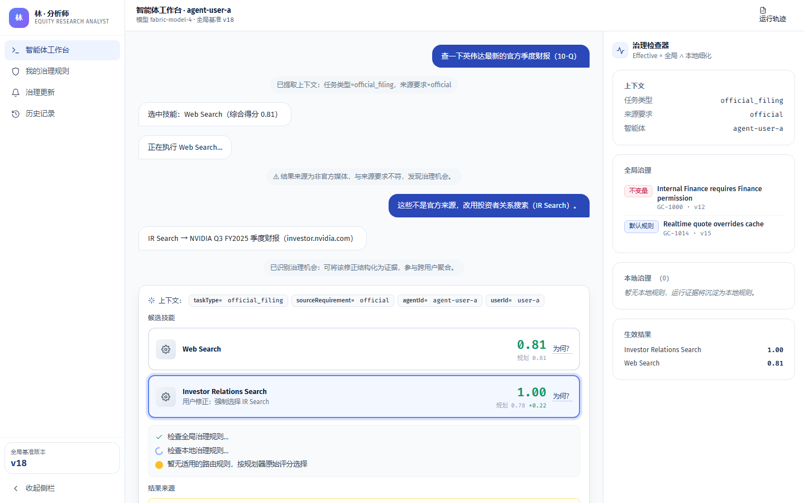

#### 步骤 4 · `a-build`（关注窗口：user-a）

> **旁白**：A 把这次修正结构化为本地证据，并生成本地规则：官方公告场景下 IRSearch 优先于 WebSearch。

**看点**：进入证据构建器（结构化提取过程）

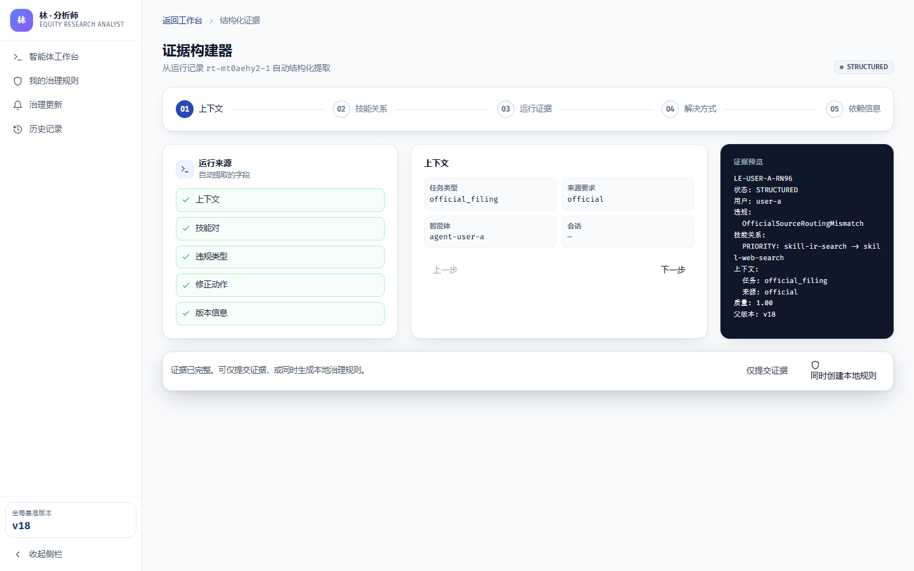

#### 步骤 5 · `a-create-rule`（关注窗口：user-a）

> **旁白**：证据构建器自动提取上下文、技能关系、违规类型、版本依赖，一键提交并创建本地契约 LC-A。

**看点**：返回工作台，本地规则 LC-A 生效

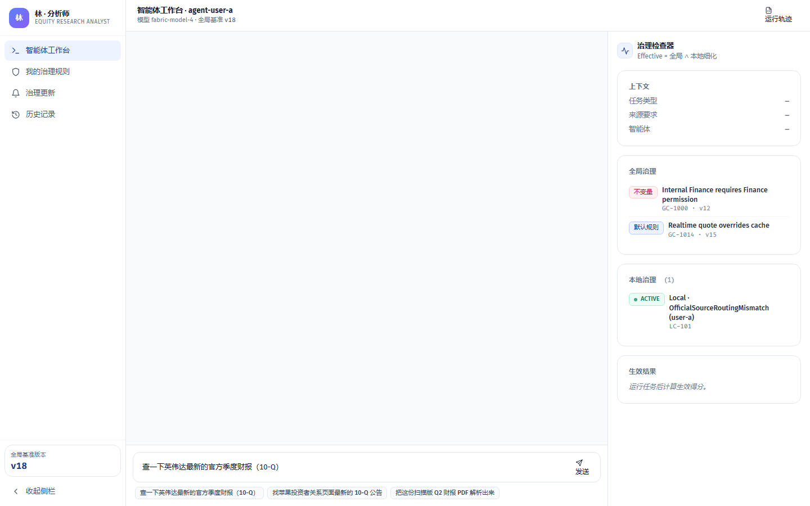

### 第二幕 · B、C 遇到同样问题，三份证据汇聚（步骤 6–13）

#### 步骤 6 · `b-run`（关注窗口：user-b）

> **旁白**：User B（陈·投研助理）遇到完全相同的问题：Web Search 返回非官方来源。

**看点**：User B 工作台出现相同违规

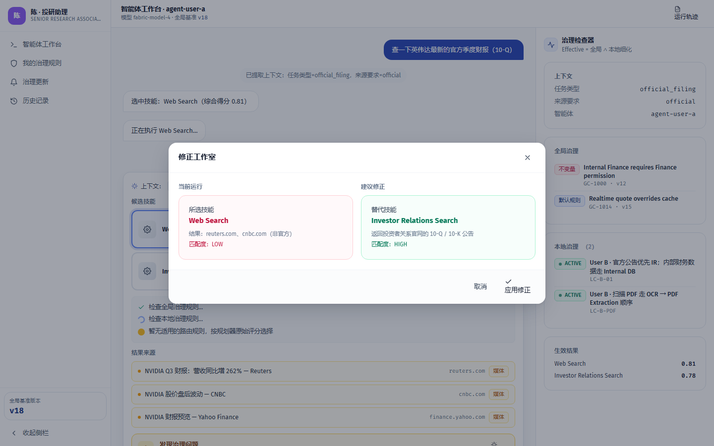

#### 步骤 7 · `b-correct-build`（关注窗口：user-b）

> **旁白**：B 同样修正并提交证据。注意 B 的本地规则还包含「internal_resource=true」这个用户特有条件。

**看点**：B 的修正包含本地特有条件

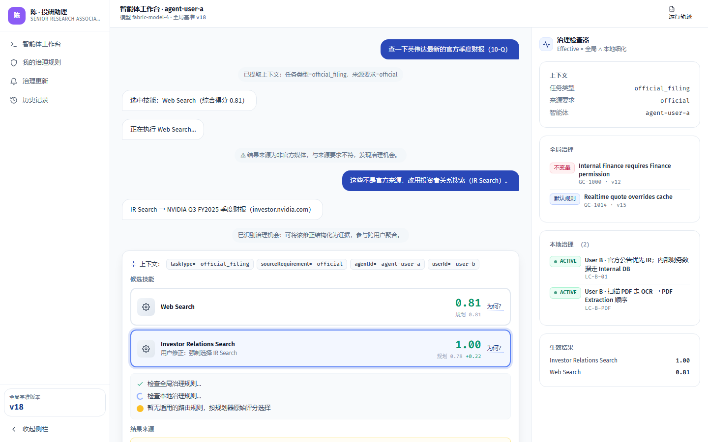

#### 步骤 8 · `b-build`（关注窗口：user-b）

> **旁白**：B 的证据被结构化并发送给开发者端。

**看点**：证据构建器提取 B 的运行证据

#### 步骤 9 · `b-create-rule`（关注窗口：user-b）

> **旁白**：B 的本地规则创建完成。

**看点**：B 的本地规则 LC-B 生效

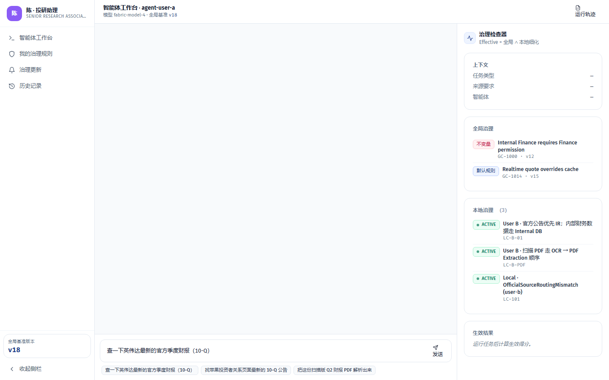

#### 步骤 10 · `c-run`（关注窗口：user-c）

> **旁白**：User C（周·交易员）的终端网络策略屏蔽了 IR 站点，本地规则强制只走 Web Search。同样的官方公告任务也触发了问题。

**看点**：C 的本地规则与任务需求冲突

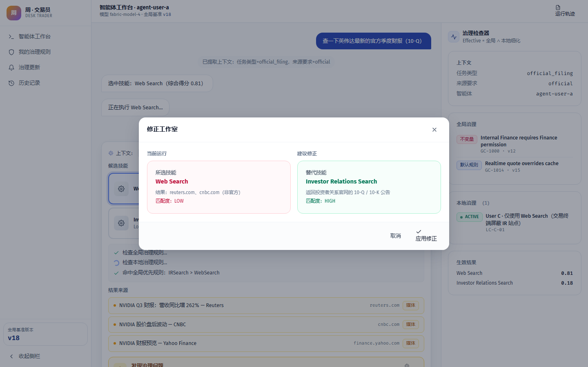

#### 步骤 11 · `c-correct-build`（关注窗口：user-c）

> **旁白**：C 提交修正证据。现在三份独立证据指向同一类问题。

**看点**：C 完成修正，第三份证据产生

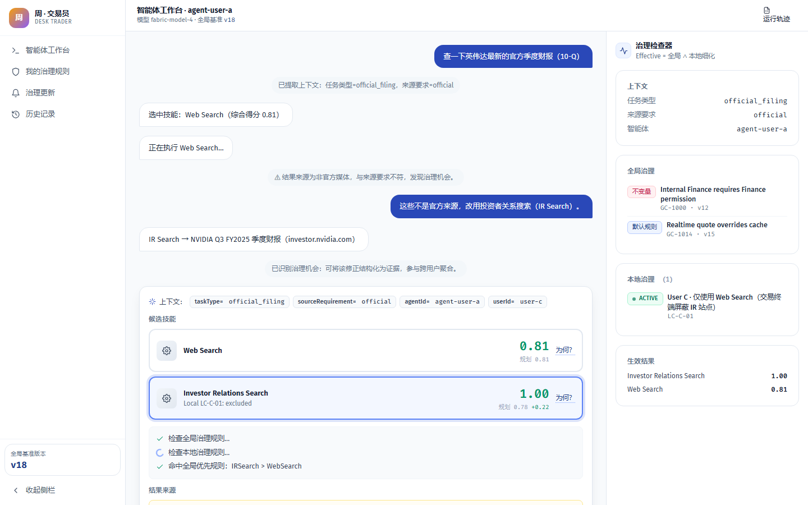

#### 步骤 12 · `c-build`（关注窗口：user-c）

> **旁白**：C 的证据发送到开发者端，聚类即将越过升级阈值。

**看点**：证据结构化完成

#### 步骤 13 · `c-create-rule`（关注窗口：user-c）

> **旁白**：C 的本地规则（强制 WebSearch）已建立——它将在全局发布后与新规则产生冲突。

**看点**：C 的冲突型本地规则 LC-C 建立

### 第三幕 · 开发者端聚类、审批、发布 v19（步骤 14–19）

#### 步骤 14 · `dev-cluster`（关注窗口：developer）

> **旁白**：第三幕 · 切到开发者端。三份证据自动聚类，独立用户数=3、结果一致性=100%，升级评分 0.78 越过阈值 0.75 → PROMOTION READY。

**看点**：证据聚类卡片：评分 0.78、PROMOTION READY

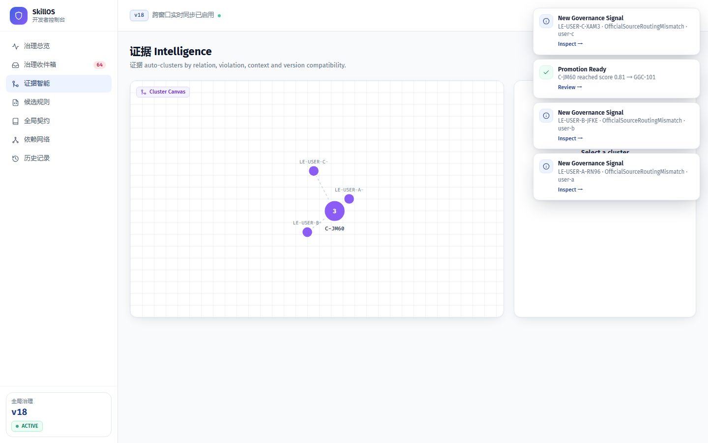

#### 步骤 15 · `dev-candidate`（关注窗口：developer）

> **旁白**：系统自动生成全局候选 GGC：当任务类型=官方公告时，IRSearch 优先于 WebSearch。

**看点**：全局候选审查页 GGC

#### 步骤 16 · `dev-approve`（关注窗口：developer）

> **旁白**：开发者审批通过，进入全局契约编辑器。

**看点**：契约编辑器预填候选内容

#### 步骤 17 · `dev-impact`（关注窗口：developer）

> **旁白**：影响分析：扫描依赖图，发现 3 个受影响本地契约（A、B、C 各一个）。

**看点**：影响分析：3 个受影响契约

#### 步骤 18 · `dev-publish`（关注窗口：developer）

> **旁白**：发布全局治理 v18 → v19。依赖波沿全局契约→技能关系→本地契约逐层传播。

**看点**：发布成功，版本升级 v18 → v19

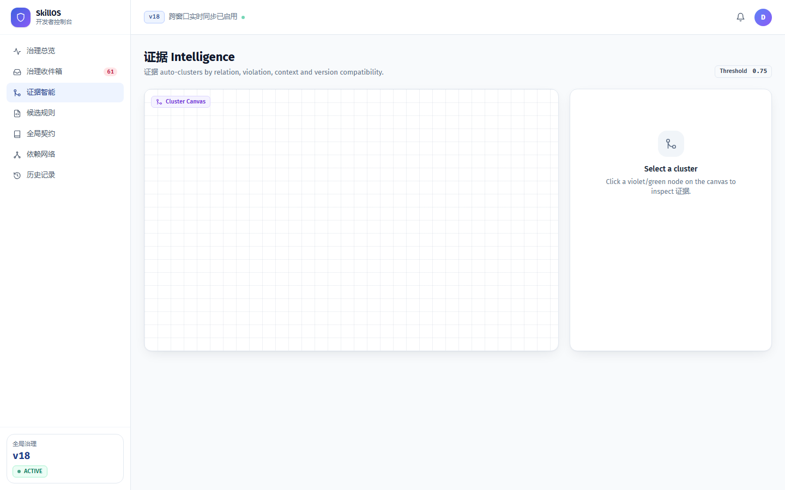

#### 步骤 19 · `dev-propagation`（关注窗口：developer）

> **旁白**：传播监控：提交 → 依赖扫描 → 本地失效 → 重验证。

**看点**：传播监控页 DELTA-19 全链路状态

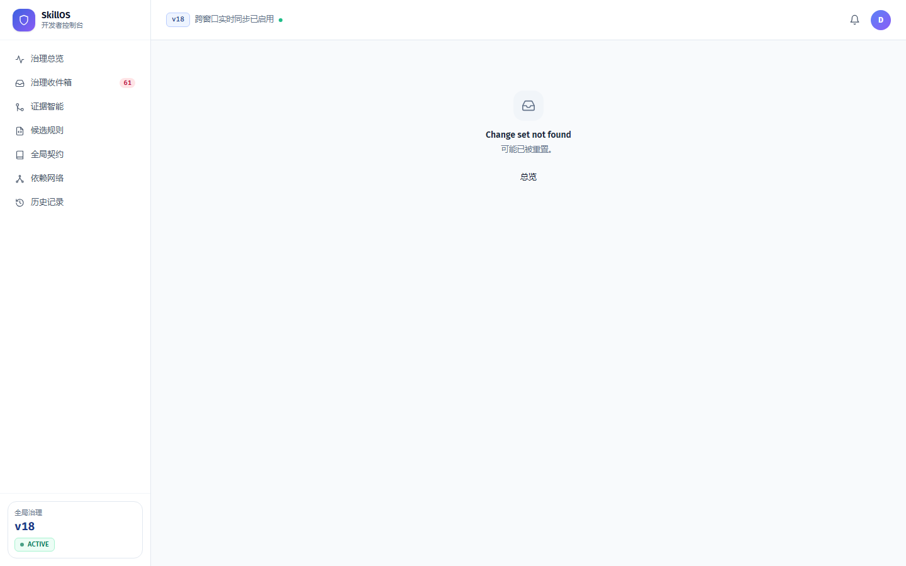

### 第四幕 · 三种本地结局：退役 / 精化 / 冲突（步骤 20–22）

#### 步骤 20 · `outcome-a`（关注窗口：user-a）

> **旁白**：第四幕 · 三个用户窗口同时收到 v19。User A 的本地规则被全局完全覆盖 → RETIRED（退役）。

**看点**：User A 治理页：LC-A 状态 RETIRED

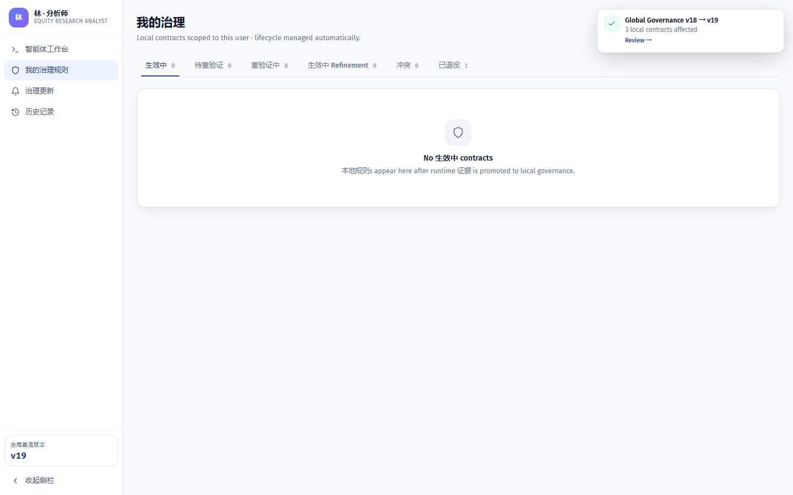

#### 步骤 21 · `outcome-b`（关注窗口：user-b）

> **旁白**：User B 的规则包含 internal_resource 这一本地特有条件 → ACTIVE_REFINEMENT（共享部分被吸收，本地部分保留）。

**看点**：User B 治理页：LC-B 状态 ACTIVE_REFINEMENT

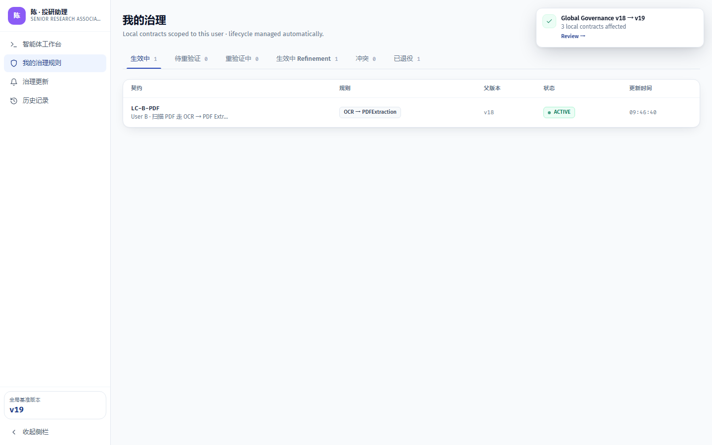

#### 步骤 22 · `outcome-c`（关注窗口：user-c）

> **旁白**：User C 的本地规则强制 WebSearch，与新全局规则方向相反 → CONFLICT，进入冲突解决器。

**看点**：User C 冲突解决器：LC-C CONFLICT

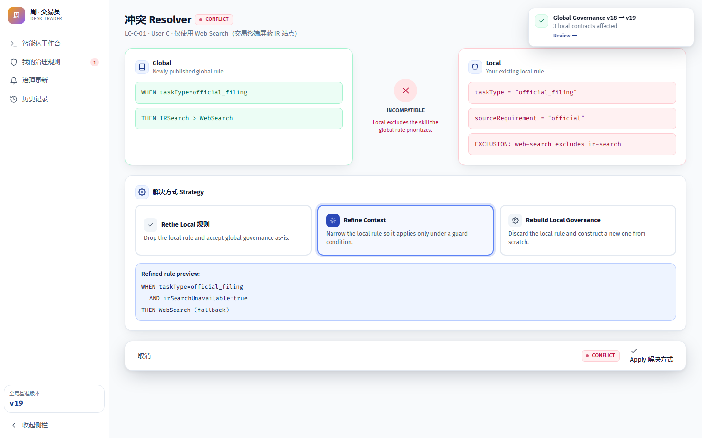

### 第五幕 · 闭环验证（步骤 23–24）

#### 步骤 23 · `closure`（关注窗口：user-a）

> **旁白**：第五幕 · 闭环验证。User A 再次运行同样的任务，这次全局规则生效：IRSearch 得分从 0.78 提升到 1.00，WebSearch 降到 0.61，IRSearch 被选中，直接返回官方来源。

**看点**：User A 工作台，全局规则已生效

#### 步骤 24 · `closure-run`（关注窗口：user-a）

> **旁白**：局部运行证据 → 全局治理演化 → 局部重验证与消解。专利三段式闭环完成。

**看点**：官方来源结果 + 全局规则命中

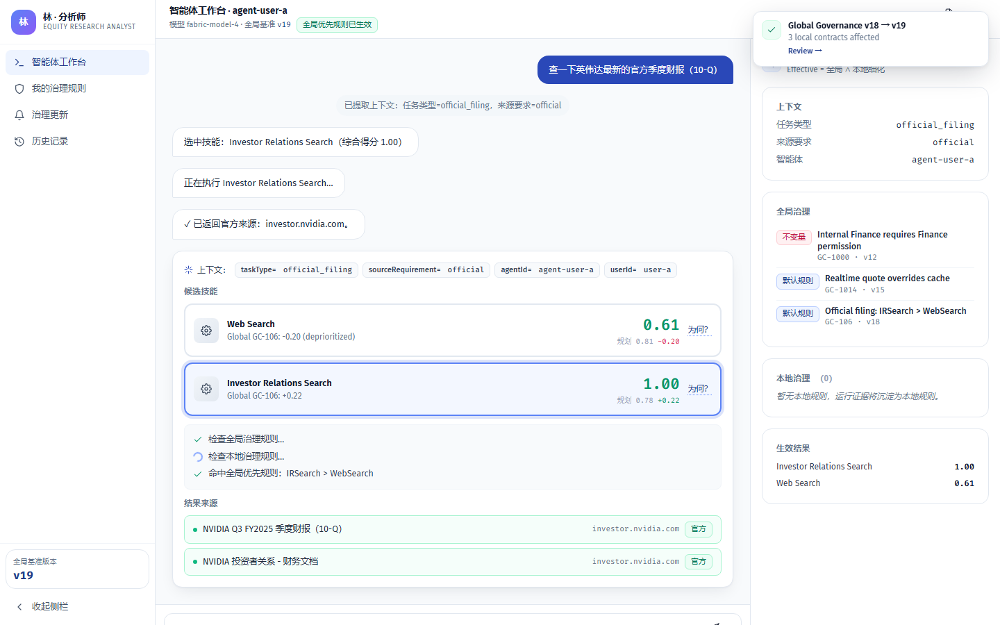

### 收尾：演示结束后的演示台

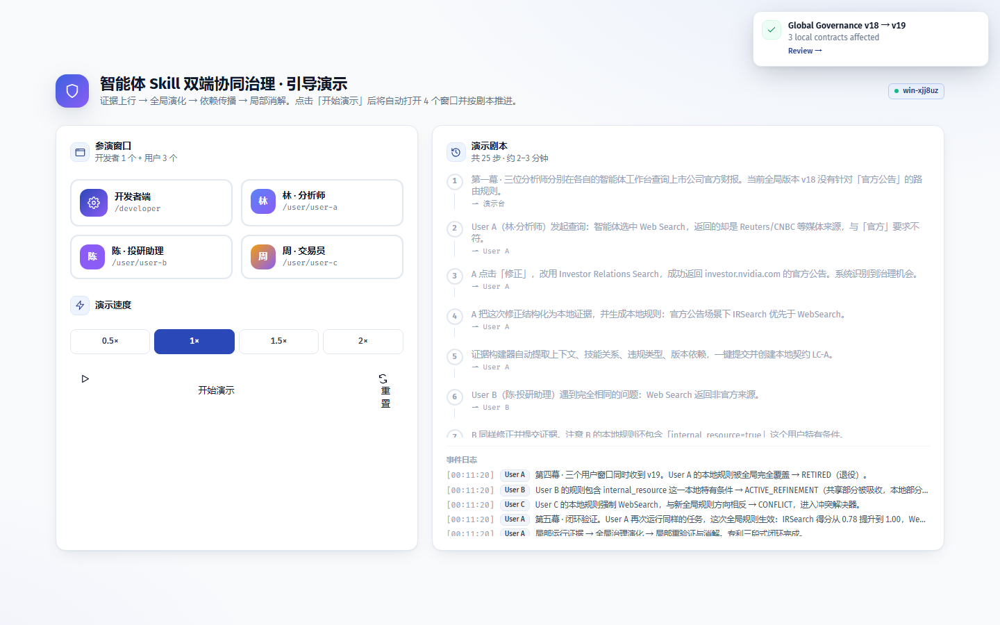

---

## 附注

- 截图脚本：`web/scripts/capture_demo.py`（Playwright，可重复执行）。
- 若剧本（`demoScript.ts`）调整了步骤或等待时长，重新运行脚本即可重新生成本文档。
