# 一种基于运行证据反馈与治理契约依赖的智能体技能双端协同治理方法

## 一、技术领域

本发明涉及人工智能智能体、智能体技能管理、共享技能库治理、运行状态同步及智能体运行控制技术领域，具体涉及一种在开发者端与用户端之间，利用局部运行证据反馈、全局治理状态演化以及治理契约依赖传播，实现智能体技能全局治理状态与局部治理状态持续协同的方法。

本发明中的双端包括：

- 开发者端，用于维护共享技能、技能版本以及作用于多个用户或智能体的全局治理状态；
- 用户端，用于维护特定用户、智能体、会话或者任务环境中的局部治理状态，并在真实运行过程中形成局部运行证据。

开发者端和用户端属于具有不同信息可见范围和治理作用范围的两个逻辑治理域。二者可以部署于不同计算设备、不同服务节点或者不同系统模块中，并可通过一个或多个中间服务完成运行证据传输、治理状态同步及依赖关系维护。

---

# 二、发明背景与现有技术

随着大模型智能体逐步采用基于技能（Skill）的动态能力扩展模式，大量技能被持续创建、发布和更新，并沉淀至共享技能库，由不同用户根据任务需要组合至不同智能体中运行。

在该运行模式下，同一共享技能可以同时服务于大量相互独立的用户，但技能开发者与实际使用者所能够观察和控制的系统状态存在明显差异。

开发者端通常能够获得：

- 共享技能定义；
- 技能版本；
- 技能发布状态；
- 已知技能关系；
- 全局治理规则；
- 共享运行约束；
- 技能更新历史。

因此，开发者端能够从共享技能生态角度维护跨用户的全局治理状态，并能够修改共享技能、全局技能关系以及全局治理规则。

但是，开发者端通常无法在技能发布前完整获得每一个用户实际运行时的：

- 技能组合；
- 用户权限；
- 具体任务上下文；
- 私有资源状态；
- 环境依赖；
- 会话状态；
- 实际执行轨迹；
- 用户特有运行约束。

因此，开发者端形成的全局治理状态无法预先覆盖所有真实用户环境。

用户端则能够直接观察当前智能体的：

- 实际技能集合；
- 当前任务；
- 当前权限；
- 当前资源状态；
- 当前运行环境；
- 技能调用过程；
- 工具执行轨迹；
- 实际运行异常。

因此，用户端能够在真实运行过程中发现仅在特定用户环境、权限状态、资源状态或任务条件下出现的局部问题。

但是，单一用户端所观察到的问题并不能直接代表共享技能生态中的普遍问题。若单一用户的特殊权限、资源条件或者任务偏好直接修改全局技能关系，可能将局部特例错误提升为作用于其他用户的全局规则。

另一方面，如果用户端形成的局部治理状态始终与开发者端的全局治理状态相互独立，则当共享技能、技能版本或者全局治理规则后续发生变化时，旧的局部治理规则可能继续参与运行，由此产生：

- 重复治理；
- 规则冲突；
- 版本失配；
- 过期局部约束；
- 已被全局解决的问题继续由局部规则重复处理。

因此，仅依赖开发者端的全局治理无法覆盖真实用户上下文，仅依赖用户端的局部治理也无法维护共享技能生态的一致性。

本发明关注的并非单一治理端内部的技能关系检测或者冲突解决过程，而是全局治理状态与局部治理状态之间的跨作用域协同。

具体需要解决的技术问题为：

> 在开发者端掌握共享技能及全局控制状态、用户端掌握真实运行上下文及运行证据的条件下，如何使用户端局部运行证据有条件地推动全局治理状态演化，并在全局治理状态变化后主动确定受影响的局部治理状态，对其进行重新验证和动态消解，从而使共享技能系统中的全局治理关系与局部治理关系持续保持一致。

---

# 三、发明目的及总体方案

## 3.1 发明目的

本发明旨在建立一种面向智能体技能治理的开发者端与用户端双向协同机制，使开发者端维护的全局治理状态与用户端基于真实运行环境形成的局部治理状态能够持续交互、动态演化并保持一致。

具体而言，本发明利用用户端在智能体真实运行过程中形成的结构化运行证据，对局部技能关系问题进行识别、记录和反馈，并通过对来自多个相互独立用户端的相关证据进行聚合分析，判断所述局部问题是否具有跨用户、跨智能体或者跨任务环境的共享治理意义。

当相关运行证据满足预设的全局治理升级条件时，系统基于所述运行证据形成全局治理候选，并由开发者端据此更新共享技能、技能关系、技能版本或者全局治理契约，从而实现局部运行经验向全局治理状态的有条件演化。

当开发者端的共享技能、技能版本、全局技能关系或者全局治理契约发生变化时，系统进一步生成与所述变化对应的全局治理变更信息，并将所述变更信息传播至相关用户端。用户端依据其局部治理状态中保存的全局契约依赖、技能版本依赖、技能关系依赖及上下文依赖，确定受到所述全局治理变化影响的局部治理状态，并对其执行重新验证。

通过上述机制，使局部治理状态能够依据新的全局治理状态及当前用户运行上下文，被继续保留、进一步细化、退役或者重新进入治理流程；重新验证后的局部治理状态继续参与后续智能体的技能检索、技能路由、技能规划或者技能执行过程，并由后续真实运行继续产生新的运行证据。

由此，本发明在开发者端与用户端之间形成一种以运行证据上行、全局治理演化、治理变更下行、局部治理重新验证及后续运行反馈为核心的持续双向治理协同机制。

```mermaid
%%{init: {'flowchart': {'curve': 'basis', 'nodeSpacing': 40, 'rankSpacing': 60}, 'theme': 'base'}}%%
flowchart LR
    %% 定义节点样式
    classDef userNode fill:#e3f2fd,stroke:#1976d2,stroke-width:2px,color:#0d47a1,font-weight:bold;
    classDef govNode fill:#fff3e0,stroke:#f57c00,stroke-width:2px,color:#e65100,font-weight:bold;
    classDef devNode fill:#e8f5e9,stroke:#388e3c,stroke-width:2px,color:#1b5e20,font-weight:bold;

    subgraph U ["👤 User Domain · 用户端局部治理域"]
        direction TB
        R1["🤖 Agent Runtime<br/>智能体运行"]
        E["📊 Local Evidence<br/>局部运行证据"]
        LC["⚙️ Local Governance<br/>局部治理状态"]
        RV["🔄 Revalidation<br/>重新验证"]
    end

    subgraph G ["🔗 Governance Coordination · 治理协同层"]
        direction TB
        AG["📥 Evidence Aggregation<br/>跨用户证据聚合"]
        DS["🎯 Dependency Matching<br/>治理依赖匹配"]
    end

    subgraph D ["💻 Developer Domain · 开发者端全局治理域"]
        direction TB
        C["💡 Global Candidate<br/>全局治理候选"]
        GC["🌐 Global Governance<br/>全局治理状态"]
        CH["🚀 Global Change<br/>全局治理变更"]
    end

    %% 内部逻辑连线
    R1 --> E
    LC --> RV
    C --> GC --> CH

    %% 跨域流转连线
    E -->|"证据上行"| AG
    AG -->|"满足升级条件"| C
    CH -->|"治理变更下行"| DS
    DS -->|"定位受影响局部治理"| RV
    
    %% 闭环与反馈连线
    RV -->|"退役 / 细化 / 冲突处理"| LC
    LC -->|"参与后续路由与执行"| R1

    %% 应用节点样式
    class R1,E,LC,RV userNode;
    class AG,DS govNode;
    class C,GC,CH devNode;

    %% 应用 Subgraph 样式 (使用虚线边框增加科技感)
    style U fill:#f8fbff,stroke:#1976d2,stroke-width:2px,color:#0d47a1,stroke-dasharray: 5 5
    style G fill:#fffbf5,stroke:#f57c00,stroke-width:2px,color:#e65100,stroke-dasharray: 5 5
    style D fill:#f5fff5,stroke:#388e3c,stroke-width:2px,color:#1b5e20,stroke-dasharray: 5 5
    
    %% 统一连线样式
    linkStyle default stroke:#78909c,stroke-width:2px;
```

## 3.2 三段式协同机制

本发明的技术方案主要包括以下三个相互衔接并循环执行的协同阶段。

### 第一阶段：局部运行证据形成、上行与全局治理升级

用户端在智能体执行实际任务的过程中，根据当前加载的技能集合、任务上下文、用户权限、资源状态、运行环境、技能调用轨迹、执行结果以及用户纠正信息，识别可能存在的技能关系异常或者治理冲突，并形成结构化的局部运行证据。

所述局部运行证据至少可以包括：

- 涉及的技能或者技能关系；
- 运行任务及上下文条件；
- 相关技能版本；
- 实际执行轨迹或者执行结果；
- 异常类型或者冲突类型；
- 用户纠正或者局部治理结果；
- 当前全局治理版本；
- 运行证据的时间、来源及可信度信息。

用户端将满足上报条件的局部运行证据发送至开发者端或者相应治理服务。

系统对来自多个相互独立用户端的运行证据进行关联、聚合和一致性分析，并根据证据出现频率、独立用户覆盖程度、上下文相似程度、技能关系一致程度、治理结果一致程度、相关技能版本兼容程度以及证据质量中的一种或多种指标，判断相关局部问题是否具有共享治理意义。

当相关证据满足预设的全局治理升级条件时，系统基于所述证据聚合结果形成全局治理候选。

所述全局治理候选至少可以包括：

- 候选治理适用条件；
- 候选技能关系；
- 候选治理类型；
- 候选适用范围；
- 对应运行证据集合；
- 候选形成依据；
- 影响范围或者风险信息。

开发者端对所述全局治理候选进行确认、修改、批准或者拒绝。

经开发者端批准的全局治理候选用于生成或者更新全局治理状态，从而完成从用户端局部运行证据向开发者端全局治理状态的治理升级过程。

该阶段形成：

\[
\boxed{
\text{用户端真实运行}
\rightarrow
\text{局部运行证据}
\rightarrow
\text{跨用户证据聚合}
\rightarrow
\text{全局治理候选}
\rightarrow
\text{开发者端全局治理}
}
\]

的上行治理链路。

### 第二阶段：全局治理变化下行传播与局部影响定位

开发者端基于全局治理候选、共享技能更新、技能版本更新、技能关系调整或者其他全局治理操作，对全局治理状态进行变更。

所述全局治理状态变化可以包括以下一种或者多种：

- 新增、修改、停用或者撤销全局治理契约；
- 修改共享技能之间的优先、顺序、互斥、替代、隔离或者权限关系；
- 更新共享技能版本；
- 修改治理适用条件或者上下文模式；
- 修改全局治理适用范围；
- 修改其他能够影响用户端技能检索、路由、规划或者执行的共享治理信息。

当全局治理状态发生变化时，系统生成对应的全局治理变更信息。

所述全局治理变更信息至少可以包括：

- 变化前的全局治理版本；
- 变化后的全局治理版本；
- 发生变化的全局治理契约；
- 发生变化的技能及技能版本；
- 发生变化的技能关系；
- 发生变化的上下文条件或者治理范围；
- 所述变化可能影响的局部治理依赖类型。

开发者端或者治理服务将所述全局治理变更信息向相关用户端传播。

各用户端根据其局部治理状态中预先保存的治理依赖关系，对所述全局治理变化执行影响匹配。

所述治理依赖关系至少可以包括：

- 对特定全局治理契约的依赖；
- 对特定技能及其版本的依赖；
- 对特定技能关系的依赖；
- 对特定任务类型、权限状态、资源状态或者上下文模式的依赖。

当任一局部治理状态的治理依赖关系与所述全局治理变更信息相匹配时，将该局部治理状态确定为受影响局部治理状态，并将其从默认有效状态转换为待重新验证状态。

对于未受到所述全局治理变化影响的局部治理状态，可以继续维持原有治理状态，而无需进行无差别重新验证。

该阶段形成：

\[
\boxed{
\text{开发者端全局治理变化}
\rightarrow
\text{全局治理变更信息}
\rightarrow
\text{用户端接收}
\rightarrow
\text{治理依赖匹配}
\rightarrow
\text{受影响局部治理状态定位}
}
\]

的下行治理链路。

### 第三阶段：局部治理重新验证、动态消解与运行回流

用户端在接收到全局治理变更信息并确定受影响局部治理状态后，基于更新后的全局治理状态、当前用户运行上下文以及所述局部治理状态的原始治理条件，对受影响局部治理状态执行重新验证。

重新验证至少包括以下判断中的一种或者多种：

1. 判断新的全局治理状态是否已经完整覆盖原局部治理状态所解决的问题；
2. 判断原局部治理状态是否仍包含用户、智能体、任务、权限、资源、环境或者会话特有的治理条件；
3. 判断原局部治理状态与新的全局治理状态之间是否存在技能关系冲突、治理条件冲突或者执行约束冲突；
4. 判断相关技能版本变化是否已经消除原局部治理状态所针对的运行问题。

根据重新验证结果，对受影响局部治理状态执行动态消解。

当新的全局治理状态已经完整覆盖原局部治理状态的适用条件及治理效果时，将所述局部治理状态退役，使其不再重复参与后续治理决策。

当新的全局治理状态仅覆盖原局部治理状态的共享部分，而原局部治理状态仍包含用户特有、资源特有、权限特有、智能体特有、任务特有或者会话特有条件时，保留所述局部治理状态，并将其更新为相对于当前全局治理状态的局部细化治理状态。

当原局部治理状态与新的全局治理状态存在不兼容关系时，将所述局部治理状态标记为冲突状态，并重新触发相应的局部治理流程、用户确认流程或者开发者治理流程。

重新验证完成后，更新后的局部治理状态继续参与后续智能体运行过程中的技能检索、技能筛选、技能排序、技能路由、技能规划或者技能执行。

所述后续智能体运行过程进一步产生新的运行轨迹、执行结果、异常信息或者用户纠正信息，并形成新的局部运行证据；所述新的局部运行证据继续按照第一阶段参与后续治理过程。

因此，该阶段形成：

\[
\boxed{
\text{受影响局部治理状态}
\rightarrow
\text{重新验证}
\rightarrow
\text{退役 / 局部细化 / 冲突处理}
\rightarrow
\text{后续智能体运行}
\rightarrow
\text{新的局部运行证据}
}
\]

的局部治理更新及运行回流链路。

综上，本发明所建立的三段式协同机制形成如下持续治理闭环：

\[
\boxed{
\text{用户端运行}
\rightarrow
\text{局部运行证据上行}
\rightarrow
\text{开发者端全局治理演化}
\rightarrow
\text{全局治理变化下行}
\rightarrow
\text{用户端局部治理重新验证}
\rightarrow
\text{后续用户端运行}
}
\]

进一步可以表示为：

\[
\boxed{
\text{User}
\rightarrow
\text{Developer}
\rightarrow
\text{User}
\rightarrow
\text{Runtime}
\rightarrow
\text{User}
\rightarrow
\cdots
}
\]

其中，用户端通过真实运行证据向开发者端提供全局治理演化依据；开发者端通过全局治理变更信息向相关用户端传播新的共享治理状态及其影响；用户端根据本地治理依赖关系执行影响定位和重新验证，并将重新验证后的治理状态应用于后续智能体运行。

由此，实现全局治理状态与局部治理状态之间的双向传播、依赖关联、动态演化及持续一致性维护。

---

# 四、双端治理状态及依赖关系

## 4.1 开发者端全局治理状态

设开发者端维护的全局治理状态为：

\[
GS_G=
(
\mathcal{S},
V,
R_G,
GC_G,
H_G
)
\]

其中：

- \(\mathcal{S}\) 表示共享技能集合；
- \(V\) 表示共享技能版本状态；
- \(R_G\) 表示共享技能之间的全局关系；
- \(GC_G\) 表示全局治理契约；
- \(H_G\) 表示全局治理、发布及验证历史。

全局治理契约用于描述作用于多个用户或智能体的共享运行约束，其可以包括：

- 技能适用条件；
- 技能优先关系；
- 技能互斥关系；
- 技能执行顺序；
- 失败替代关系；
- 权限约束；
- 资源隔离关系；
- 版本条件；
- 其他能够作用于技能检索、路由、规划或者执行过程的治理规则。

## 4.2 用户端局部治理状态

对于任一用户 \(u\)，用户端维护：

\[
GS_L^{(u)}
=
(
S_u,
X_u,
R_L^{(u)},
GC_L^{(u)},
E_u
)
\]

其中：

- \(S_u\) 表示用户当前智能体实际加载的技能集合；
- \(X_u\) 表示当前运行上下文；
- \(R_L^{(u)}\) 表示在当前用户环境中成立的局部技能关系；
- \(GC_L^{(u)}\) 表示局部治理契约；
- \(E_u\) 表示用户真实运行过程中形成的运行证据。

运行上下文可以表示为：

\[
X_u=
(
Task,
Permission,
Resource,
Environment,
Session
)
\]

其中至少可以包括任务、权限、资源、运行环境和会话状态中的一种或多种。

## 4.3 全局状态与局部状态的关系

全局治理状态用于描述在共享技能生态范围内成立的治理关系，但无法穷尽每一个用户运行上下文。

局部治理状态用于描述特定用户、智能体、会话或者任务范围内成立的治理关系，但不能直接代表全部用户。

因此：

\[
GS_G
\neq
\bigcup_u GS_L^{(u)}
\]

并且单一：

\[
GS_L^{(u)}
\]

不能直接替代：

\[
GS_G
\]

本发明通过局部运行证据上行和全局治理状态下行，将上述两类治理状态建立为持续协同关系。

## 4.4 局部治理对全局状态的依赖

局部治理契约产生时，系统同时保存其依赖状态。

对于局部治理契约 \(GC_L^{(u)}\)，定义：

\[
Dep
\left(
GC_L^{(u)}
\right)
=
(
ParentContract,
SkillVersion,
Relationship,
ContextSchema
)
\]

其中：

- `ParentContract` 表示局部治理形成时所依赖的全局治理契约或全局治理版本；
- `SkillVersion` 表示局部治理所针对的技能版本；
- `Relationship` 表示该局部治理所细化、补充或者修正的技能关系；
- `ContextSchema` 表示该局部治理成立所依赖的上下文类型或上下文结构。

上述依赖关系用于在后续全局治理发生变化后确定受影响的局部治理状态。

---

# 五、局部运行证据向全局治理演化

本阶段完成：

\[
\boxed{
\text{局部运行}
\rightarrow
\text{局部证据}
\rightarrow
\text{证据聚合}
\rightarrow
\text{全局治理候选}
\rightarrow
\text{全局治理更新}
}
\]

## 5.1 局部运行证据形成

用户端在真实运行过程中，可以通过运行监测、技能冲突检测、执行失败检测、用户纠正、自动治理模块或者其他运行分析方式发现局部技能关系异常。

本发明对具体异常检测算法不作限定。

对于任一局部治理事件，系统生成结构化局部治理证据：

\[
LE_i=
(
SkillRelation,
ViolationType,
Context,
RuntimeEvidence,
LocalResolution,
LocalContract,
ParentVersion
)
\]

其中：

- `SkillRelation` 表示相关技能或者技能关系；
- `ViolationType` 表示局部运行中观察到的问题类型；
- `Context` 表示问题发生时的运行上下文；
- `RuntimeEvidence` 表示相应执行轨迹、工具调用、资源变化、异常或者其他运行证据；
- `LocalResolution` 表示用户端已经采用的局部治理结果；
- `LocalContract` 表示依据该治理结果形成的局部治理契约；
- `ParentVersion` 表示所述局部治理形成时依赖的全局治理状态版本或者技能版本。

其中，`LocalResolution` 和 `LocalContract` 可以根据用户端治理状态选择性存在。

因此，用户端向共享治理系统提供的是与实际技能关系、真实运行上下文以及全局版本状态相关联的结构化运行证据，而非脱离运行条件的单一异常描述。

## 5.2 跨用户证据聚合

设系统获得多个用户端产生的局部治理证据：

\[
\mathcal{LE}
=
\{
LE_1,
LE_2,
\ldots,
LE_n
\}
\]

系统根据一个或多个下列维度对局部治理证据进行关联或聚合：

- 涉及的 Skill Pair 或 Skill Set；
- 技能关系类型；
- 问题类型；
- 根因特征；
- 运行上下文特征；
- 技能版本；
- 所依赖的全局治理版本；
- 局部治理结果。

形成：

\[
Cluster_k
\subseteq
\mathcal{LE}
\]

对于任一证据聚类，可以计算其重复频率：

\[
F_k=
|Cluster_k|
\]

计算受影响用户覆盖范围：

\[
C_k=
\frac{
|\mathrm{Users}(Cluster_k)|
}{
|\mathrm{ActiveUsers}|
}
\]

计算多个独立用户端治理结果的一致性：

\[
R_k=
\frac{
\max_j N(Resolution_j)
}{
|Cluster_k|
}
\]

其中 \(N(Resolution_j)\) 表示采用同一类治理结果的用户端证据数量。

还可以进一步结合运行证据质量、问题风险或者运行影响形成全局升级评分：

\[
G_k
=
\alpha F_k
+
\beta C_k
+
\gamma R_k
+
\delta Q_k
\]

其中 \(Q_k\) 表示证据质量或者问题风险，\(\alpha\)、\(\beta\)、\(\gamma\) 和 \(\delta\) 表示相应权重。

当：

\[
G_k
\geq
\tau_G
\]

或者满足系统设定的其他全局升级条件时，形成：

\[
GGC_k
=
GlobalGovernanceCandidate
\]

即全局治理候选。

通过上述机制，单一用户产生的特殊运行问题首先保持在局部作用范围内；只有当多个独立用户端形成足够一致且具有共享意义的运行证据后，相应问题才进入全局治理过程。

## 5.3 全局治理候选处理

开发者端接收到全局治理候选后，根据候选中包含的：

- 相关技能；
- 技能关系；
- 运行上下文；
- 运行证据；
- 用户覆盖范围；
- 问题一致性；
- 局部治理结果；
- 当前技能版本和全局治理版本；

确定是否需要修改共享治理状态。

开发者端可以执行下列一种或多种处理：

- 修改共享技能；
- 更新技能版本；
- 修改全局技能关系；
- 修改全局治理契约；
- 增加新的全局治理规则；
- 拒绝全局治理候选并继续将问题保持为局部治理事项。

本发明对开发者端内部具体使用人工决策、规则引擎或者自动治理算法不作限定。

当开发者端确认需要修改全局治理状态时，全局治理状态由：

\[
GS_G^{(v)}
\]

变化为：

\[
GS_G^{(v+1)}
\]

相应全局治理契约可以由：

\[
GC_G^{(v)}
\]

更新为：

\[
GC_G^{(v+1)}
\]

系统记录本次全局变化：

\[
\Delta G
=
GS_G^{(v+1)}
-
GS_G^{(v)}
\]

所述变化可以包括：

- Skill Version 变化；
- Global Contract 变化；
- Skill Relationship 变化；
- 权限模型变化；
- 上下文模型变化；
- 共享资源约束变化。

该全局变化进一步作为开发者端向用户端传播的输入。

---

# 六、全局治理变化向局部状态传播

本阶段完成：

\[
\boxed{
\text{全局治理变化}
\rightarrow
\text{依赖分析}
\rightarrow
\text{受影响局部状态}
}
\]

## 6.1 受影响局部治理状态确定

当：

\[
GS_G^{(v)}
\rightarrow
GS_G^{(v+1)}
\]

以后，系统不直接将新的全局治理契约复制并覆盖全部用户端局部治理状态，而是依据局部治理状态保存的依赖关系确定真正受影响的局部治理集合。

定义：

\[
\mathcal{L}_{affected}
=
\left\{
GC_L^{(u)}
\mid
Affected
(
Dep(GC_L^{(u)}),
\Delta G
)
=1
\right\}
\]

其中，`Affected` 用于判断某一局部治理契约的验证基础是否因本次全局变化而发生变化。

受影响条件可以包括：

- Parent Global Contract 版本发生变化；
- 所依赖 Skill Version 发生变化；
- 所依赖 Skill Relationship 发生变化；
- 所依赖 Context Schema 发生不兼容变化；
- 相关权限、资源或者运行约束发生变化。

通过上述过程，系统只确定与当前全局变化存在实际依赖关系的局部治理状态，而不要求所有用户端局部治理规则进行无差别重新处理。

## 6.2 局部治理状态失效传播

对于：

\[
GC_L^{(u)}
\in
\mathcal{L}_{affected}
\]

系统将其原有状态：

\[
Active
\]

转换为：

\[
Stale
\]

其中，`Stale` 表示：

> 该局部治理规则原有的验证基础已经因全局技能或全局治理状态变化而发生改变，因此不能继续直接沿用原有有效性结论。

系统随后使其进入：

\[
Revalidating
\]

状态。

因此，开发者端发生的全局治理变化会沿治理契约依赖关系主动传播至受影响用户端，而无需等待相同用户再次发生原运行异常后才重新发现旧局部治理规则已经失效。

---

# 七、局部治理状态重新验证与动态消解

本阶段完成：

\[
\boxed{
Stale
\rightarrow
Revalidating
\rightarrow
Retired
/
ActiveRefinement
/
Conflict
}
\]

## 7.1 重验证输入

对于进入 `Revalidating` 状态的局部治理契约 \(GC_L^{(u)}\)，系统至少根据以下信息重新确定其有效性：

- 新的全局治理状态；
- 新的全局治理契约；
- 当前技能版本；
- 当前用户运行上下文；
- 原局部治理所针对的技能关系；
- 原局部运行证据；
- 原局部治理结果。

因此，局部治理重验证并非重新从零进行全量治理，而是利用已经保存的局部治理状态及其依赖关系，在新的全局治理基础上重新判断该局部规则是否仍有独立存在必要。

## 7.2 局部治理被全局治理覆盖

如果新的全局治理状态已经包含原局部治理所要求的运行关系，即：

\[
GC_L^{(u)}
\subseteq
GC_G^{(v+1)}
\]

则原局部治理规则所解决的问题已经在共享治理层面得到处理。

此时系统将：

\[
GC_L^{(u)}
\]

状态更新为：

\[
Retired
\]

退役后的局部治理契约不再重复参与当前用户端的智能体运行控制。

## 7.3 局部治理继续作为上下文细化

如果新的全局治理状态解决了共享关系问题，但原局部治理中仍包含用户特有条件，例如：

- 特殊权限；
- 私有资源；
- 特定 Agent；
- 特定 Session；
- 特定 Task；
- 用户独有环境；

则：

\[
GC_L^{(u)}
=
GC_G^{(v+1)}
+
Refinement(X_u)
\]

系统将该局部治理契约恢复为：

\[
ActiveRefinement
\]

并继续在其局部作用范围内参与运行。

因此，全局治理负责维护可共享的基础关系，局部治理仅保留不能被全局规则完全表达的用户特有条件。

## 7.4 局部治理与新全局治理发生冲突

如果重验证发现原局部治理与新的全局治理状态无法兼容，则局部治理契约进入：

\[
Conflict
\]

状态。

系统进一步触发相应用户端治理过程，以形成符合新的全局治理基础以及当前用户上下文的新局部治理状态。

因此，一次全局治理变化对局部治理状态可以形成：

\[
Revalidate
\rightarrow
\begin{cases}
Retired\\
ActiveRefinement\\
Conflict
\end{cases}
\]

通过该动态消解机制，可以减少旧局部治理规则长期累积造成的：

- 重复约束；
- 历史规则残留；
- 版本不一致；
- 全局与局部行为分叉。

---

# 八、全局治理与局部治理的运行合并

完成全局治理状态更新及局部治理状态重验证后，系统根据当前用户上下文生成实际参与智能体运行的有效治理规则。

## 8.1 有效治理契约

设开发者端当前生效的全局治理契约为：

\[
GC_G
\]

用户端当前有效的局部治理契约为：

\[
GC_L^{(u)}
\]

则用户端实际执行时使用：

\[
GC_{eff}^{(u)}
=
Merge
\left(
GC_G,
GC_L^{(u)},
X_u
\right)
\]

其中 \(GC_{eff}^{(u)}\) 表示当前用户、智能体或者任务条件下的有效治理契约。

## 8.2 治理规则合并条件

所述合并过程可以综合考虑：

- 约束等级；
- 作用范围；
- 条件特异性；
- 局部覆盖权限；
- 技能版本；
- 当前用户上下文。

治理约束可以包括：

### 全局不变量

用于描述用户端不能放宽的全局强制约束，例如：

- 权限上限；
- 高风险资源限制；
- 强制隔离；
- 禁止执行关系；
- 安全运行条件。

### 全局默认规则

用于描述共享技能系统中默认采用的：

- 路由关系；
- 技能优先关系；
- 默认执行顺序；
- 默认 fallback；
- 默认适用条件。

### 局部细化规则

用于描述特定用户上下文中对全局默认行为的进一步细化，例如：

- 用户特有优先关系；
- 特定任务下的执行顺序；
- 特殊资源条件；
- 用户权限相关替代关系。

在一种实施方式中，可以满足：

\[
GC_{eff}
=
GlobalInvariant
\land
Resolve
(
GlobalDefault,
LocalRefinement
)
\]

即首先保证全局不变量得到满足，再在全局允许局部细化的范围内，根据当前上下文确定全局默认规则和局部细化规则之间的实际运行关系。

如果全局治理规则设置：

\[
OverridePermission=0
\]

则局部治理规则不能放宽对应全局约束。

对于允许细化的全局默认规则，可以根据作用范围和条件具体程度优先采用更加匹配当前用户运行上下文的局部规则。

## 8.3 对智能体运行的作用

最终得到的有效治理契约可以直接参与智能体的：

- Skill Retrieval；
- Skill Routing；
- Skill Planning；
- Skill Execution；
- Tool Invocation；
- Resource Access；
- Permission Control。

例如：

- 根据 Predicate 过滤不适用技能；
- 根据 Priority 调整技能排序；
- 根据 Order 控制执行顺序；
- 根据 Exclusion 阻止不允许的技能组合；
- 根据 Isolation 控制资源隔离；
- 根据 Fallback 控制失败后的替代技能；
- 根据 Permission Constraint 控制技能是否允许执行。

因此，双端治理状态的协同结果最终表现为智能体实际运行行为的变化。

---

# 九、双端治理完整状态闭环

结合前述机制，本发明形成完整的跨作用域治理状态循环：

\[
\boxed{
\begin{aligned}
&\text{开发者端全局治理状态}\\
&\downarrow\\
&GC_G^{(v)}\\
&\downarrow\\
&\text{用户端真实运行}\\
&\downarrow\\
&LE_1,LE_2,\ldots,LE_n\\
&\downarrow\\
&\text{跨用户证据聚合}\\
&\downarrow\\
&GlobalGovernanceCandidate\\
&\downarrow\\
&\text{开发者端全局治理演化}\\
&\downarrow\\
&GC_G^{(v+1)}\\
&\downarrow\\
&\text{治理依赖传播}\\
&\downarrow\\
&GC_L:Active\rightarrow Stale\\
&\downarrow\\
&\text{局部治理重新验证}\\
&\downarrow\\
&Retired/ActiveRefinement/Conflict\\
&\downarrow\\
&\text{Global/Local运行合并}\\
&\downarrow\\
&\text{用户端继续运行}
\end{aligned}
}
\]

用户端继续运行后还会形成新的运行证据，并再次进入后续治理过程。

因此形成持续循环：

\[
\boxed{
\text{局部证据上行}
\rightarrow
\text{全局治理更新}
\rightarrow
\text{局部状态消解}
\rightarrow
\text{新的局部运行}
}
\]

上述闭环使开发者端维护的共享治理状态与大量用户端真实运行状态形成持续双向作用关系。

---

# 十、实施例

## 10.1 实施例一：多个局部运行问题升级为全局治理规则

共享技能库中存在：

- 通用 Web Search Skill；
- Investor Relations Search Skill。

初始全局治理状态中没有针对“上市公司官方财报查询”建立二者之间的明确优先关系。

多个相互独立的用户分别将上述两个 Skills 配置至自己的 Agent 中。

对于如下任务：

> 查询某上市公司的官方季度财报。

多个用户端真实运行结果显示：

- 通用 Web Search 可以处理该任务；
- Investor Relations Search 也可以处理该任务；
- 不同 Agent 在相似任务中产生了不稳定的技能选择行为。

各用户端分别形成局部治理状态：

\[
official\_filing
\Rightarrow
InvestorRelationsSearch
\]

并形成局部治理证据：

\[
LE_i
\]

其中包括：

- 相关 Skill Pair；
- 财报查询任务上下文；
- 实际 Runtime Trace；
- 当前局部治理结果；
- Local Contract；
- 当前 Skill Version；
- 当前 Global Contract Version。

系统聚合多个独立用户端证据，形成：

\[
Cluster_{IR}
\]

并计算：

\[
F_{IR}
\]

\[
C_{IR}
\]

以及：

\[
R_{IR}
\]

当上述指标满足全局升级条件时，形成：

\[
GGC_{IR}
\]

开发者端根据该全局治理候选确认：

> 对于官方财报查询，应优先采用 Investor Relations Search。

因此全局治理契约由：

\[
GC_G^{(1)}
\]

更新为：

\[
GC_G^{(2)}
\]

并增加：

\[
official\_filing
\Rightarrow
InvestorRelationsSearch
\]

的全局治理关系。

系统随后根据局部治理契约保存的 Skill Relationship 和 Parent Global Version，确定曾针对相同问题形成的 Local Contracts。

对于其治理内容已经被：

\[
GC_G^{(2)}
\]

完整覆盖的局部治理契约：

\[
GC_L^{(u)}
\subseteq
GC_G^{(2)}
\]

系统将其更新为：

\[
Retired
\]

对于同时包含用户特殊权限、内部数据源或者其他用户特有条件的 Local Contract，则将其保留为：

\[
ActiveRefinement
\]

由此完成：

\[
User
\rightarrow
Developer
\rightarrow
User
\]

的完整双端协同治理。

---

## 10.2 实施例二：全局技能版本变化导致局部治理状态重新验证

某用户端针对 Skill Version 2.3 形成局部治理契约：

\[
GC_L
\]

所述局部治理契约记录：

\[
SkillVersion=2.3
\]

并记录：

\[
ParentContract=GC_G^{(5)}
\]

随后，开发者更新共享技能：

\[
SkillVersion:
2.3
\rightarrow
2.4
\]

同时发布：

\[
GC_G^{(6)}
\]

系统根据 Local Contract 保存的：

- Skill Version；
- Parent Contract；
- Skill Relationship；

确定：

\[
GC_L
\in
\mathcal{L}_{affected}
\]

因此其生命周期由：

\[
Active
\rightarrow
Stale
\rightarrow
Revalidating
\]

系统随后基于：

- Skill 2.4；
- Global Contract 6；
- 当前用户 Context；
- 原 Local Runtime Evidence；

重新验证该局部治理状态。

如果 Skill 2.4 或 Global Contract 6 已经包含原局部治理所实现的修复关系，则：

\[
GC_L
\rightarrow
Retired
\]

如果原 Local Contract 仍包含当前用户特有资源或者权限条件，则：

\[
GC_L
\rightarrow
ActiveRefinement
\]

由此避免针对 Skill 2.3 形成的旧 Local Contract 在 Skill 升级以后继续无条件参与运行。

---

## 10.3 实施例三：局部治理不能突破全局强制约束

开发者端全局治理契约设置：

\[
PermissionRequired=1
\]

并将该条件设为全局不可放宽约束：

\[
OverridePermission=0
\]

某一用户端由于特定任务需要，形成一个局部治理规则，希望在当前 Task 下直接调用相应 Skill。

虽然该 Local Contract 的作用范围仅为当前 Task，其上下文条件比 Global Rule 更具体，但是系统首先满足全局不可放宽约束。

因此，有效治理契约仍包含：

\[
PermissionRequired=1
\]

用户端不能通过 Local Refinement 解除该权限要求。

只有在满足全局权限条件后，系统才进一步根据 Task Context 应用允许的局部治理规则。

该实施例表明，局部治理用于针对真实上下文细化共享运行关系，但不能突破全局治理中明确设置为不可覆盖的强制约束。

---

## 10.4 实施例四：用户特有问题不进入全局治理

某用户由于内部私有数据源和特定权限模型，需要在两个 Skills 之间增加用户特有的资源隔离规则：

\[
GC_L^{(u)}
\]

该局部治理证据上传后，系统未发现其他独立用户具有相同资源条件，也没有形成具有足够用户覆盖范围的证据聚类。

因此，该问题不满足全局治理升级条件。

系统保留：

\[
GC_L^{(u)}
\]

作为当前用户范围内的：

\[
ActiveRefinement
\]

而不修改全局治理状态。

由此避免单一用户特殊资源环境被错误提升为共享技能系统的全局运行约束。

---

# 十一、有益效果及核心保护点

## 11.1 有益效果

与开发者端和用户端彼此独立维护治理状态的方式相比，本发明至少具有以下技术效果。

### 第一，利用真实用户运行证据弥补开发者端运行上下文不可完全预知的问题

开发者端无需在 Skill 发布时枚举所有用户权限、任务、资源和环境状态，而能够通过用户端后续真实运行证据持续发现共享技能关系中的潜在系统性问题。

### 第二，避免单一用户特殊问题直接污染全局治理状态

局部运行问题需要经过多个独立用户端证据聚合后才能形成全局治理候选，使局部问题向全局问题的升级具有明确条件。

### 第三，实现全局治理变化向局部治理状态的主动传播

局部治理契约保存其 Parent Contract、Skill Version 和 Skill Relationship 等依赖信息。

当共享 Skill 或 Global Contract 更新时，系统能够主动确定受影响 Local Contracts，而无需等待对应用户再次发生运行错误。

### 第四，实现局部治理状态的持续消解

旧 Local Contract 在 Global Governance 变化后不会无限期参与运行。

系统通过重新验证将其动态转换为：

- Retired；
- Active Refinement；
- Conflict。

由此降低历史局部规则长期累积造成的治理复杂度。

### 第五，使共享治理与用户环境适配同时成立

Global Governance 维护共享技能系统的基础关系和不可放宽约束；

Local Governance 仅针对更加具体的用户上下文进行细化。

系统通过有效治理契约合并，使用户端保持环境适应能力，同时维持共享技能生态中的全局治理边界。

### 第六，形成持续的双向治理状态演化机制

用户端运行证据推动全局治理演化；

全局治理演化又触发用户端局部治理状态重新验证；

重新验证后的用户运行继续形成新的运行证据。

因此，Skill Governance 从单次治理行为转换为：

\[
\boxed{
\text{Local Runtime Evidence}
\rightarrow
\text{Global Governance Evolution}
\rightarrow
\text{Local Governance Revalidation}
}
\]

的持续双向状态协同过程。

---

## 11.2 核心保护点

本发明建议重点围绕以下相互关联的技术关系进行保护。

### 第一，双端异构治理状态

在开发者端维护作用于共享 Skill 集合的全局治理状态，在用户端维护作用于特定用户运行上下文的局部治理状态，并使局部治理状态保存对全局治理状态及 Skill Version 的依赖信息。

### 第二，结构化局部运行证据

用户端形成与：

- Skill Relationship；
- Runtime Context；
- Runtime Evidence；
- Skill Version；
- Parent Global Version；

相关联的局部运行证据。

### 第三，局部证据向全局治理的条件升级

基于多个独立用户端证据的：

- 重复性；
- 用户覆盖范围；
- 问题一致性；
- 治理结果一致性；
- 证据质量；

确定是否形成 Global Governance Candidate，避免由单一局部事件直接修改全局治理。

### 第四，全局治理变化的依赖传播

开发者端 Global Governance State 发生变化后，根据局部治理状态保存的：

- Parent Contract；
- Skill Version；
- Skill Relationship；
- Context Dependency；

主动确定受影响的 Local Governance State。

### 第五，局部治理状态重验证与动态消解

受影响 Local Contract 由：

\[
Active
\rightarrow
Stale
\rightarrow
Revalidating
\]

并根据新的 Global Governance 和当前 Local Context 动态转换为：

\[
Retired
\]

或者：

\[
ActiveRefinement
\]

或者：

\[
Conflict
\]

### 第六，全局治理与局部治理共同控制真实运行

根据 Global Governance、Local Refinement、当前 Context 以及相应覆盖权限生成 Effective Governance Contract，并使其直接作用于智能体的 Skill Retrieval、Routing、Planning 或 Runtime。

---

## 11.3 发明核心概括

本发明利用用户端真实运行证据有条件地推动开发者端全局治理演化，并利用全局治理状态变化反向触发依赖该状态的局部治理状态重新验证，从而形成：

\[
\boxed{
\text{局部证据上行}
\rightarrow
\text{全局状态更新}
\rightarrow
\text{局部状态消解}
}
\]

的双向协同闭环。

其中：

- **证据升级机制**解决局部问题何时能够进入全局治理；
- **依赖传播机制**解决全局变化如何主动定位受影响局部治理状态；
- **局部状态消解机制**解决全局演化后历史局部治理状态如何继续有效、退役或者重新治理。

三种机制共同实现开发者端全局治理与用户端局部治理之间的跨作用域持续协同。